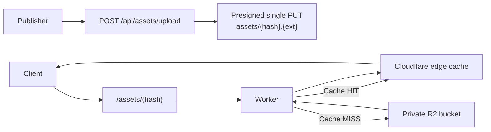

# 7. Asset Serving

## Request Processing

`GET /assets/{hash}` — headers: `accept: */*`, `accept-encoding: br, gzip`

## Architecture: Direct Upload to R2, Public Read Through Worker Edge Cache

Assets are uploaded directly to R2 with presigned URLs, but they are served via `GET /assets/{hash}` from the Worker. The Worker reads from R2, sets immutable caching headers, and populates the Cloudflare edge cache.

## Upload Contract

1. Client calls `POST /api/assets/upload` with `{ projectId, assets: [{ hash, contentType, fileExt }] }`
2. Server inserts missing asset metadata rows with `byte_size = 0`
3. Server returns `uploaded[]` entries with:
   - `uploadMode: "single"`
   - `uploadUrl`
   - `uploadExpiresAt`
   - `uploadHeaders` including `content-type` and `x-amz-checksum-sha256`
4. Client uploads bytes directly to R2
5. Client calls `POST /api/assets/{hash}/finalize`
6. Server verifies the uploaded object's R2 size, content type, and SHA-256 checksum before setting `byte_size`

## R2 Object Metadata

When uploading assets to R2, set HTTP metadata and signed checksum headers:

| R2 field         | Value                                |
| ---------------- | ------------------------------------ |
| **Key**          | `assets/{hash}.{ext}`                |
| **Content-Type** | MIME type of the asset               |
| **Checksum**     | SHA-256 from `x-amz-checksum-sha256` |

The Worker adds `Cache-Control: public, max-age=31536000, immutable` when serving assets.

## R2 Key Design

Namespace: `assets/{hash}.{ext}`. The hash is the content address (base64url SHA-256), while the extension preserves a stable content-type hint for tooling and debugging.

## Why This Works

Assets are **content-addressed and immutable**:

- Same hash = same content, forever
- Never need to invalidate asset cache (no purge needed)
- `immutable` cache directive = CDN caches for 1 year

This means:

- **No cache purge** needed when publishing (new update = new hashes = new URLs)
- **Worker edge caching** reduces repeated R2 reads after the first miss
- **Client deduplication** — expo-updates only downloads assets not already cached locally

## Compression

- Store assets uncompressed in R2 (original bytes, matching the hash for integrity verification)
- Cloudflare can still compress eligible responses at the edge based on the Worker-served `Content-Type`
- The Worker path remains simple: read object, set headers, cache response
