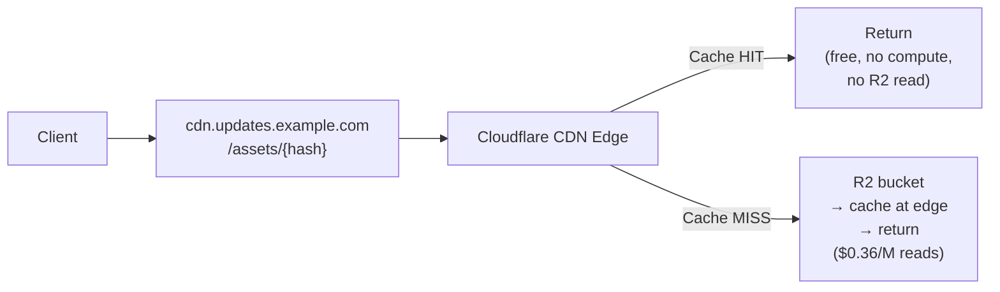

# 7. Asset Serving

## Request Processing

`GET /assets/{hash}` — headers: `accept: */*`, `accept-encoding: br, gzip`

## Architecture: R2 Public Bucket (No Worker)

Assets are served from an **R2 public bucket on a custom domain** (`cdn.updates.example.com`), completely bypassing the Worker. This is the primary cost optimization — asset downloads generate zero Worker invocations.

## Setup

1. Create R2 bucket: `better-update-assets`
2. Connect custom domain: `cdn.updates.example.com` → R2 bucket
3. Add Cache Rule: path `/assets/*` → "Cache Everything", Edge TTL = 1 year

## R2 Object Metadata

When uploading assets to R2, set HTTP metadata:

| R2 field          | Value                                 |
| ----------------- | ------------------------------------- |
| **Key**           | `assets/{hash}`                       |
| **Content-Type**  | MIME type of the asset                |
| **Cache-Control** | `public, max-age=31536000, immutable` |

R2 public bucket serves these headers automatically — no Worker needed to set them.

## R2 Key Design

Simple, flat namespace: `assets/{hash}`. The hash is the content address (base64url SHA-256). R2 handles flat namespaces efficiently.

## Why This Works

Assets are **content-addressed and immutable**:

- Same hash = same content, forever
- Never need to invalidate asset cache (no purge needed)
- `immutable` cache directive = CDN caches for 1 year

This means:

- **No Worker invocation** for asset requests
- **No cache purge** needed when publishing (new update = new hashes = new URLs)
- **CDN edge caching** reduces R2 reads (popular assets cached globally)
- **Client deduplication** — expo-updates only downloads assets not already cached locally

## Compression

- Store assets uncompressed in R2 (original bytes, matching the hash for integrity verification)
- Cloudflare CDN automatically handles Brotli/Gzip compression for eligible content types
- No Worker needed for content negotiation
