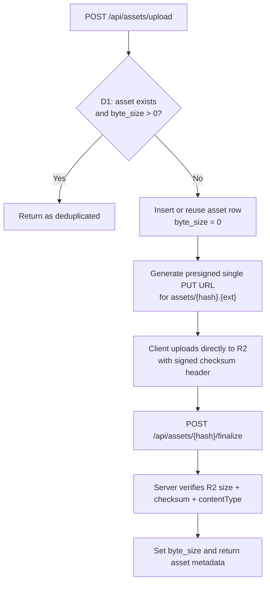
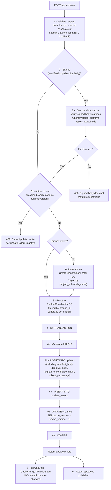
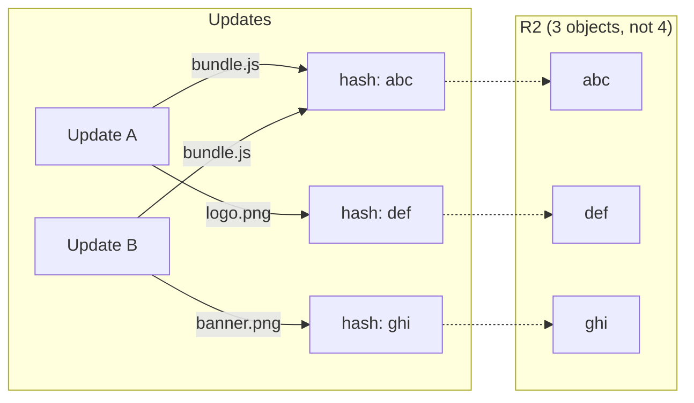

# 8. Update Publishing

## Publish Flow

Publishing is a two-phase process: upload assets, then create the update record.

### Phase 1: Asset Upload

`POST /api/assets/upload` (`application/json`) registers asset metadata and returns presigned upload details:

| Field         | Type   | Description                         |
| ------------- | ------ | ----------------------------------- |
| `projectId`   | string | Project ID                          |
| `assets[]`    | array  | `{ hash, contentType, fileExt }`    |
| `hash`        | string | base64url SHA-256 (client-computed) |
| `contentType` | string | MIME type                           |
| `fileExt`     | string | File extension (e.g., `js`)         |

Processing:



`POST /api/assets/upload` response:

```json
{
  "uploaded": [
    {
      "hash": "base64url-sha256",
      "uploadMode": "single",
      "uploadUrl": "https://...",
      "uploadExpiresAt": "2026-04-14T12:00:00.000Z",
      "uploadHeaders": {
        "content-type": "application/javascript",
        "x-amz-checksum-sha256": "..."
      }
    }
  ],
  "deduplicated": ["already-uploaded-hash"]
}
```

### Phase 2: Create Update

`POST /api/updates` (`application/json`):

| Field               | Type                   | Required | Description                                                 |
| ------------------- | ---------------------- | -------- | ----------------------------------------------------------- |
| `branch`            | string                 | Yes      | Branch name (e.g., `"production"`)                          |
| `project`           | string                 | Yes      | Project scope key (e.g., `"scope:@user/app"`)               |
| `runtimeVersion`    | string                 | Yes      | e.g., `"1.0.0"`                                             |
| `platform`          | `"ios"` \| `"android"` | Yes      | Target platform                                             |
| `message`           | string                 | Yes      | Publish message from developer                              |
| `groupId`           | string                 | Yes      | Links iOS + Android updates from same publish               |
| `metadata`          | object                 | Yes      | Manifest metadata field                                     |
| `extra`             | object                 | No       | Manifest extra field (includes `expoClient`)                |
| `assets`            | array                  | Yes      | `[{ hash, key, isLaunch }]` — references to uploaded assets |
| `manifestBody`      | string                 | No\*     | Verbatim signed manifest JSON (required when signing)       |
| `directiveBody`     | string                 | No\*     | Verbatim signed directive JSON (for rollback directives)    |
| `isRollback`        | boolean                | No       | `true` for rollback-to-embedded directives                  |
| `signature`         | string                 | No\*     | Base64 RSA-SHA256 signature (required when signing)         |
| `certificateChain`  | string                 | No\*     | PEM certificate chain (required when signing)               |
| `rolloutPercentage` | number                 | No       | 1-100, percentage of devices to target (default: 100)       |

\* Required when code signing is enabled for the project.

Processing:



## Durable Object Coordination

**PublishCoordinator:** One DO instance per `branch_id`. Serializes concurrent publishes to the same branch to prevent race conditions. The DO does not persist state itself — it acts as a serialization lock. All durable state lives in D1 and R2. If the DO is evicted and recreated, no state is lost.

**CreateBranchCoordinator:** One DO instance per `{project_id}:{branch_name}`. Handles auto-creation of branch + channel on first publish to a new branch name. This separate DO prevents race conditions when multiple concurrent publishes target the same new branch — only the first publish creates the branch, subsequent ones wait and receive the created `branch_id`. After branch creation, the publish is forwarded to the PublishCoordinator DO keyed by the new `branch_id`.

## Asset Deduplication

Assets are globally deduplicated by content hash:



This is critical for storage efficiency — JS bundles often share the same dependencies, and static assets rarely change between updates.

## Publish Atomicity

The update record and its asset mappings are inserted in a **single D1 transaction**. This ensures an update is never visible without its assets:

```sql
BEGIN TRANSACTION;
INSERT INTO updates (...) VALUES (...);
INSERT INTO update_assets (...) VALUES (...);  -- one per asset
COMMIT;
```

If any insert fails, the entire transaction is rolled back. The manifest resolution query will not see a partially-created update.

## Signed Body Structural Validation

When `manifestBody` or `directiveBody` is provided, the server must validate that the signed JSON body is structurally consistent with the relational fields in the request. This prevents a "resolve by relational data, serve by different signed body" failure mode where the server routes based on one set of values but serves a manifest containing different values.

**Validation rules for `manifestBody`:**

| Signed body field | Must match request field           |
| ----------------- | ---------------------------------- |
| `id`              | (generated — skip)                 |
| `runtimeVersion`  | `runtimeVersion`                   |
| `launchAsset.key` | The asset with `isLaunch: true`    |
| `assets[].key`    | Each entry in `assets[]`           |
| `assets[].hash`   | Corresponding `hash` in `assets[]` |
| `extra`           | `extra` (if provided)              |

**Validation rules for `directiveBody`:**

| Signed body field       | Must match                     |
| ----------------------- | ------------------------------ |
| `type`                  | Must be `"rollBackToEmbedded"` |
| `parameters.commitTime` | Must be valid ISO 8601         |

If validation fails, return `400 Bad Request` with a descriptive error indicating which fields are inconsistent. This check runs before the D1 transaction — no data is written for invalid requests.

## Same-Runtime Publish Blocking

When the latest update on a branch for a given platform and runtime version has `rollout_percentage` between 1 and 99 (active partial rollout), new publishes to the same branch/platform/runtimeVersion are rejected with `409 Conflict`.

```sql
SELECT rollout_percentage FROM updates
WHERE branch_id = :branch_id
  AND platform = :platform
  AND runtime_version = :runtime_version
ORDER BY created_at DESC, id DESC
LIMIT 1
```

If the result has `1 <= rollout_percentage <= 99`, reject the publish. The publisher must first complete or revert the active rollout before publishing a new update.

This prevents ambiguous resolution where a partially-rolled-out update and a newer update coexist on the same branch — the client behavior in this case is undefined by the EAS protocol.
