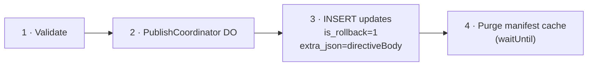

# 11. Rollback Support

## Rollback to Previous Update (Republish)

Re-publish a prior update as the newest entry on a branch. Following the EAS CLI model, the publisher constructs the full manifest (pointing to the same assets as the target update), optionally signs it, then uploads:

`POST /api/updates` — same endpoint as normal publish, with the manifest pointing to the **same assets** as the target update:

| Field              | Value                                      |
| ------------------ | ------------------------------------------ |
| `branch`           | Target branch (e.g., `"production"`)       |
| `manifestBody`     | Full manifest JSON (same assets as target) |
| `signature`        | Optional — pre-signed by publisher         |
| `certificateChain` | Optional                                   |
| `assets`           | Same asset hashes as the target update     |

Since assets are content-addressed and deduplicated, this creates no new R2 objects — only a new `updates` row pointing to the same assets.

## Rollback to Embedded (Directive)

The publisher constructs and signs the directive locally, then submits it as a regular update entry with `is_rollback = 1`. This follows the EAS CLI pattern where `eas update:roll-back-to-embedded` constructs and signs the directive client-side before uploading.

`POST /api/updates` with `isRollback: true`:

| Field              | Value                                                             |
| ------------------ | ----------------------------------------------------------------- |
| `isRollback`       | `true`                                                            |
| `directiveBody`    | `{"type":"rollBackToEmbedded","parameters":{"commitTime":"..."}}` |
| `signature`        | Optional — pre-signed directive                                   |
| `certificateChain` | Optional                                                          |
| `assets`           | `[]` (no assets for rollback directives)                          |

Processing:

When the manifest endpoint resolves the latest update and finds `is_rollback = 1`, it responds with the stored `directive_body` (served verbatim to preserve the publisher's signature). If `directive_body` is `NULL` (unsigned mode), the server constructs the directive from the update's metadata.
