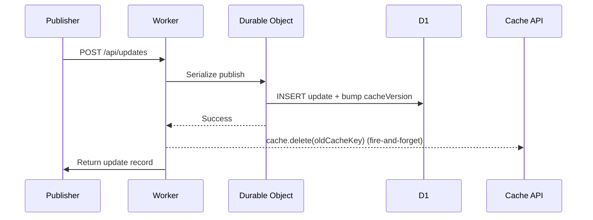

# 12. Caching Strategy

## Two-Layer Cache

| Layer             | Service          | Scope             | Purpose                           |
| ----------------- | ---------------- | ----------------- | --------------------------------- |
| **L1: Cache API** | `caches.default` | Per-datacenter    | Manifest response cache (primary) |
| **L2: KV**        | Workers KV       | Global (eventual) | Channel→branch mapping            |

## Cache API: Manifest Response Cache (L1)

The primary manifest cache uses the Workers Cache API with a **versioned composite cache key** built after all routing decisions:

**Cache key composition:** `/_cache/v{cacheVersion}/manifest/{projectId}/{channel}/{platform}/{runtimeVersion}[/{resolvedBranchId}][/{resolvedUpdateId}]`

| Segment            | Source                           | Purpose                                    |
| ------------------ | -------------------------------- | ------------------------------------------ |
| `cacheVersion`     | Channel/branch metadata          | Monotonic counter, bumped on state changes |
| `projectId`        | URL path `/manifest/{projectId}` | Isolate projects                           |
| `channel`          | Header `expo-channel-name`       | Isolate channels                           |
| `platform`         | Header `expo-platform`           | ios vs android                             |
| `runtimeVersion`   | Header `expo-runtime-version`    | Version targeting                          |
| `resolvedBranchId` | Rollout evaluation (optional)    | Differentiate rollout variants (max 2)     |
| `resolvedUpdateId` | Update rollout evaluation (opt.) | Differentiate per-update rollout variants  |

### Cache Version Token

The `cacheVersion` is a monotonic integer stored on the channel record (or derived from the latest update's UUIDv7 timestamp). It is bumped atomically with any state change that affects manifest responses:

| Event                   | Bump cache version?  |
| ----------------------- | -------------------- |
| Publish new update      | Yes                  |
| Channel relink          | Yes                  |
| Channel pause/resume    | Yes                  |
| Rollout create/edit/end | Yes                  |
| Update deletion         | Yes                  |
| Branch rename           | No (name not in key) |

By including `cacheVersion` in the cache key, stale entries are never matched — they simply become orphaned and expire naturally via Cache API LRU eviction. **Cache purge becomes a cleanup optimization, not a correctness requirement.** This eliminates the race condition between D1 commit and cache purge propagation.

Cache API stores responses in the **local datacenter only**. This means:

- Each Cloudflare PoP independently caches manifests
- First request at each PoP triggers a D1 query (cold start)
- Subsequent requests at the same PoP are served from cache (~0.1ms CPU)

This is acceptable because:

- Updates change infrequently (hours/days between publishes)
- Cold start cost is a single D1 query (~3ms), amortized across all subsequent requests
- Global cache propagation is not needed — each PoP self-populates on first request

## KV: Channel→Branch Mapping (L2) — Acceleration Only

| Field     | Value                                             |
| --------- | ------------------------------------------------- |
| **Key**   | `ch:{project_id}:{channel_name}`                  |
| **Value** | JSON: `{ branchId, isPaused, branchMappingJson }` |
| **TTL**   | 300s                                              |

KV is used **as a performance acceleration layer** for channel→branch resolution, **not as a correctness mechanism**:

- This mapping changes rarely (only on channel relink, pause/resume, rollout change)
- KV's edge-cached reads are fast (~0.5ms)
- Eventually consistent (up to 60s propagation)

### KV Stale-Read Window

**Important:** KV propagation is eventually consistent. After `KV.delete()`, stale values may persist at edge locations for up to 60 seconds. This means:

- **Pause/resume:** After pausing a channel, some edge locations may continue serving updates (or vice versa) for up to 60 seconds
- **Channel relink:** After relinking, some edge locations may serve updates from the old branch for up to 60 seconds

**KV is NOT a reliable kill switch.** If immediate consistency is required (e.g., stopping a compromised update), the primary mechanism is the `cacheVersion` bump in D1. The `cacheVersion` is included in the Cache API cache key and is bumped atomically with the D1 write — this ensures all new requests build a new cache key that cannot match stale entries. The stale window for `cacheVersion` is limited to in-flight requests only (milliseconds), not the KV propagation window (up to 60 seconds).

For emergency scenarios, combine: (1) D1 update with `cacheVersion` bump, (2) `KV.delete()` for acceleration, (3) local `cache.delete()` at the handling Worker for immediate effect at the current datacenter.

## Cache Invalidation Summary

| Event                   | cacheVersion bump | KV.delete | Cache purge (optional) |
| ----------------------- | ----------------- | --------- | ---------------------- |
| Publish                 | Yes               | No        | Yes (cleanup)          |
| Channel relink          | Yes               | Yes       | Yes (cleanup)          |
| Channel pause/resume    | Yes               | Yes       | Yes (cleanup)          |
| Rollout create/edit/end | Yes               | No        | Yes (cleanup)          |
| Update deletion         | Yes               | No        | Yes (cleanup)          |
| Branch rename           | No                | No        | No                     |

## Why Not Durable Objects for Reads?

DOs provide strong consistency but are single-instance. Using a DO for every manifest read would:

- Create a bottleneck (~500-1000 req/s per DO)
- Add latency (request routes to DO's location, not the nearest edge)
- Increase cost (DO requests + duration billing)

Cache API at each PoP gives edge latency and unlimited throughput.

---

# 13. Cache Invalidation on State Changes

## Primary Mechanism: Cache Version Token

Cache correctness is ensured by the `cacheVersion` counter in the cache key (see above). When any state change occurs (publish, relink, rollout, pause/resume, deletion), the version is bumped atomically in the same D1 write. Subsequent requests build a new cache key that cannot match old entries.

This eliminates the correctness dependency on cache purge propagation timing.

## Secondary Mechanism: Cache Purge (Cleanup)

Cache purge is used as a **performance optimization** to eagerly remove stale entries from the Cache API, reducing cold-cache overhead. It is NOT required for correctness.

On state changes, the Worker fires a purge request via `ctx.waitUntil()` (fire-and-forget):

### Purge Methods

**Recommended: Local `cache.delete()`.** Since cache correctness no longer depends on global purge (the version token handles it), local deletion is sufficient to free space at the current datacenter. Other datacenters will naturally miss on the old key and build new entries with the bumped version.

For aggressive cleanup, the Cloudflare Purge API can still be used:

| Method         | Use Case                         | Rate Limit (Free) | Propagation |
| -------------- | -------------------------------- | ----------------- | ----------- |
| **By prefix**  | Purge all manifests for a domain | 5/min, bucket 25  | ~150ms P50  |
| **Everything** | Nuclear option                   | 5/min             | ~150ms P50  |

**Important:** Cloudflare does not support purging custom cache keys set by Workers via the "purge by URL" method. Use prefix-based or "purge everything" when global cleanup is needed.

## Stale Cache Re-seeding Prevention

With the cache version token, stale re-seeding is eliminated. An in-flight request that started before a publish will build a cache key with the old version. Even if it calls `cache.put()` after the publish, it writes to the old versioned key — which will never be matched by new requests using the bumped version.

## Secrets Required

| Secret                 | Purpose                                                          |
| ---------------------- | ---------------------------------------------------------------- |
| `CLOUDFLARE_ZONE_ID`   | Zone ID for the api domain (optional, for aggressive purge only) |
| `CLOUDFLARE_API_TOKEN` | API token with "Cache Purge" permission (optional)               |

Set via `wrangler secret put`. These are only needed if using the Cloudflare Purge API for aggressive cleanup; they are not required for correctness.

## Cache TTL Strategy

| Response                                            | `Cache-Control`         | Purpose                                      |
| --------------------------------------------------- | ----------------------- | -------------------------------------------- |
| **Client-facing** (returned)                        | `private, max-age=0`    | Protocol requirement — no client/CDN caching |
| **Internal cache entry** (stored via `cache.put()`) | `public, max-age=86400` | Cache API uses this as internal TTL          |

Long internal TTL + cache version token = optimal cache hit ratio. Stale entries expire naturally via LRU.

## Client Patch Hints

Clients may send `expo-current-update-id` or enable bsdiff patch support in Expo
configuration, but the self-hosted server ignores those patch-specific hints.

Manifest responses therefore use the standard cache path regardless of
`expo-current-update-id`, and no cache-bypass logic is required for patch resolution.
