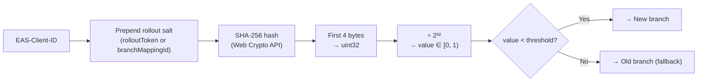
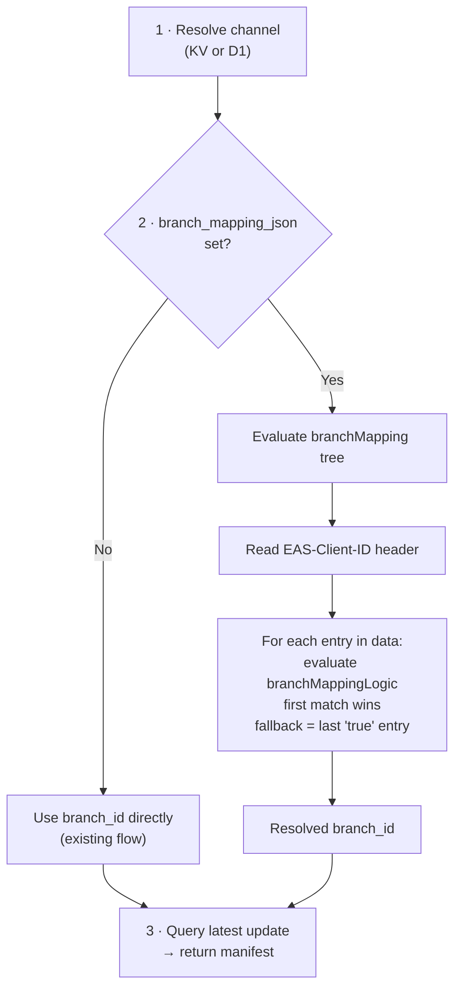

# 15. Gradual Rollouts

## Overview

Gradual rollouts allow releasing an update to a percentage of users, then increasing the percentage over time. The rollout decision is **deterministic per device** — the same device always gets the same result for the same rollout configuration.

## How It Works

EAS Update encodes rollout logic in a **branchMapping** JSON expression tree stored on the channel. The server evaluates this tree using the client's `EAS-Client-ID` header to decide which branch to serve.

## BranchMapping Data Model

The `channels` table has `branch_mapping_json` (JSON expression tree). When set, it overrides `branch_id` for manifest resolution. When `NULL`, the simple `branch_id` mapping applies.

The `data` array is evaluated **top-to-bottom**. First matching entry wins. The last entry with `"true"` is the fallback.

**Normal channel (no rollout):**

| `data[]` entry     | `branchMappingLogic` | Effect                         |
| ------------------ | -------------------- | ------------------------------ |
| `branchId: <uuid>` | `"true"`             | Always matches → single branch |

**Channel with 10% rollout to new branch:**

| `data[]` entry         | `branchMappingLogic`       | Effect                                |
| ---------------------- | -------------------------- | ------------------------------------- |
| `branchId: <new-uuid>` | `hash_lt(mappingId, 0.10)` | 10% of devices → new branch           |
| `branchId: <old-uuid>` | `"true"`                   | Remaining 90% → old branch (fallback) |

## hash_lt Operator: Deterministic Rollout Decision

The `hash_lt` operator hashes a **salted** device identifier and compares against the rollout threshold:



**Salting:** Each rollout decision uses a unique salt (e.g., the branch mapping ID or rollout record ID) prepended to the `EAS-Client-ID` before hashing. This ensures rollout decisions are **uncorrelated** across different rollouts — a device in the 10% cohort for rollout A is not necessarily in the 10% cohort for rollout B.

```
hash_input = SHA-256(rolloutSalt + ":" + EAS-Client-ID)
value = uint32(hash_input[0..4]) / 2^32    // ∈ [0, 1)
result = value < threshold
```

**Normalization:** Division by `2³²` (4294967296), not `0xFFFFFFFF`, to ensure the result is in the half-open interval `[0, 1)`. This avoids an off-by-one at the 100% boundary.

Properties:

- **Deterministic**: Same salt + `EAS-Client-ID` always produces the same hash → same bucket
- **Sticky on increase**: When threshold goes from 10% to 50%, all devices in the 10% group remain (their hash is still below the new threshold)
- **Not sticky on decrease**: When threshold goes from 50% to 10%, devices in the 10%-50% range are removed from the rollout. This is expected behavior — decreasing a rollout shrinks the cohort.
- **Uniform distribution**: SHA-256 produces uniform distribution across the [0, 1) range
- **Stateless**: No need to persist assignment — computed on every request from the salt + device ID alone
- **Uncorrelated across rollouts**: Different salts produce independent cohort assignments

## EAS-Client-ID

The expo-updates client sends `EAS-Client-ID` header on every manifest request. This is a UUID generated once per app install and persisted on device. It uniquely identifies the device/install for rollout purposes.

### Missing EAS-Client-ID

When the `EAS-Client-ID` header is absent:

- **Branch-based rollout active:** The device receives the **fallback branch** (the last `"true"` entry in the expression tree). This ensures devices without a client ID always get the stable/default branch.
- **Per-update rollout active:** The device receives the **previous update** (not the partially-rolled-out latest). If no previous update exists, `204 No Content`.
- **No rollout active:** Normal resolution — no impact.

Rationale: devices without a client ID cannot be deterministically assigned to a cohort. Serving the fallback/previous update is the safest default.

## API Endpoints

| Method  | Endpoint                             | Body                          | Effect                                                                  |
| ------- | ------------------------------------ | ----------------------------- | ----------------------------------------------------------------------- |
| `POST`  | `/api/channels/:id/rollout`          | `{ newBranchId, percentage }` | Set `branch_mapping_json`                                               |
| `PATCH` | `/api/channels/:id/rollout`          | `{ percentage }`              | Update operand in expression tree                                       |
| `POST`  | `/api/channels/:id/rollout/complete` | —                             | **Promote:** set `branch_id` to new branch, clear `branch_mapping_json` |
| `POST`  | `/api/channels/:id/rollout/revert`   | —                             | **Revert:** clear `branch_mapping_json`, keep original `branch_id`      |

### End-Rollout Actions

**"Complete" (promote) vs "Revert" are fundamentally different operations:**

| Action       | `branch_id` after           | `branch_mapping_json` after | Effect                                           |
| ------------ | --------------------------- | --------------------------- | ------------------------------------------------ |
| **Complete** | Updated to new branch       | `NULL`                      | All devices receive the new branch going forward |
| **Revert**   | Unchanged (original branch) | `NULL`                      | All devices return to the original branch        |

**Complete (promote):** The new branch "wins" the rollout. The channel's `branch_id` is updated to the new branch ID from the rollout configuration. All devices now receive updates from the new branch. This is equivalent to a channel relink + rollout end in a single atomic operation.

**Revert:** The rollout is cancelled. The channel's `branch_id` remains unchanged (the original branch). All devices return to the original branch. Devices that were in the rollout group during the rollout will now receive the original branch's updates.

Both actions bump `cache_version` and trigger cache purge + KV invalidation.

## Manifest Resolution with Rollouts



## Caching Impact

Rollouts make manifest responses **device-dependent** — different devices may see different manifests. This breaks the default Cache API strategy (one cached response per channel/platform/runtimeVersion).

**Solution: Cache by resolved branch ID.**

Since the rollout decision resolves to exactly one of two branches, the resolved `branchId` is appended to the cache key. This produces exactly **2 cache entries** per channel (one per branch outcome) — far more efficient than fragmenting into N synthetic buckets.

**Steps:** evaluate rollout → get `resolvedBranchId` → append to cache key → check cache. Only **2 distinct cache entries** exist per rollout (one per branch outcome).

Cache key with rollout: `/_cache/manifest/{project}/{channel}/{platform}/{runtimeVersion}/{resolvedBranchId}`

For channels **without** active rollouts, `resolvedBranchId` is omitted from the cache key (no overhead). The rollout evaluation (`hash_lt`) is cheap (~0.1ms, just a SHA-256 hash + comparison), so even on cache miss the overhead is negligible.

## Rollout Types

| Type             | Unit                   | Description                                                                                                     |
| ---------------- | ---------------------- | --------------------------------------------------------------------------------------------------------------- |
| **Branch-based** | Channel → two branches | Split traffic between old and new branch. New updates on either branch are served to their respective groups.   |
| **Per-update**   | Single update          | Rollout a specific update to X% before making it available to all. Updates published after it are not affected. |

Both rollout types are supported. Branch-based rollouts are the primary mechanism (this spec). Per-update rollouts are specified in [spec 17](./17-per-update-rollouts.md).
