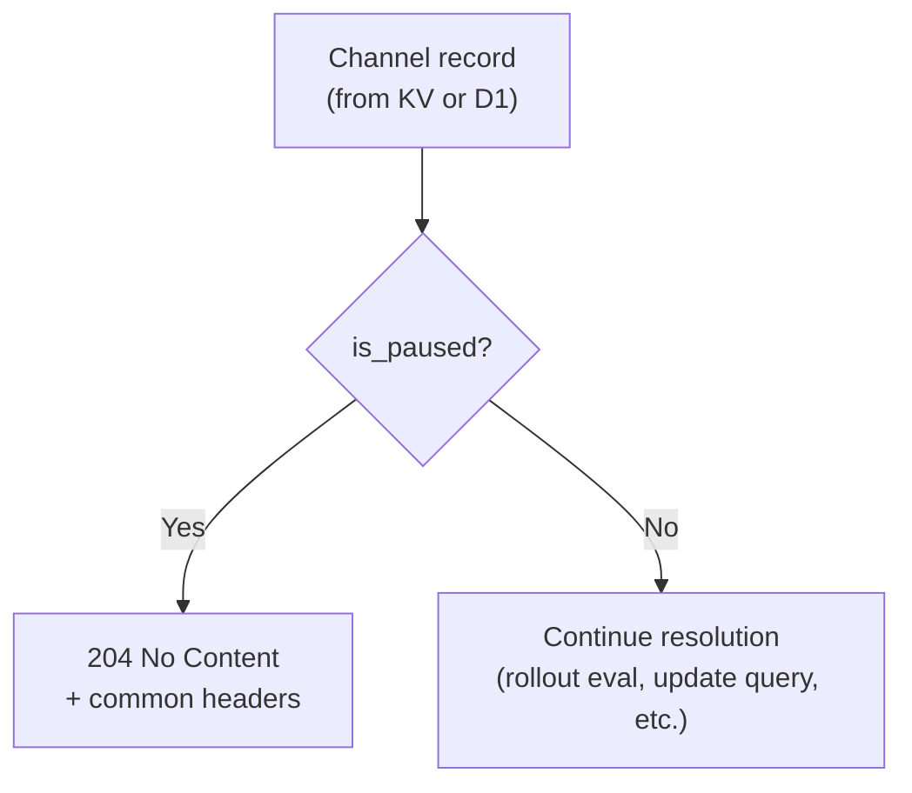
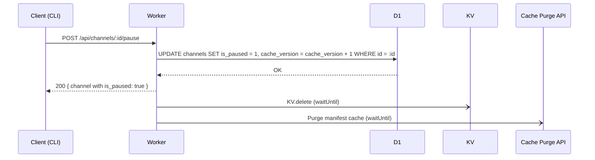
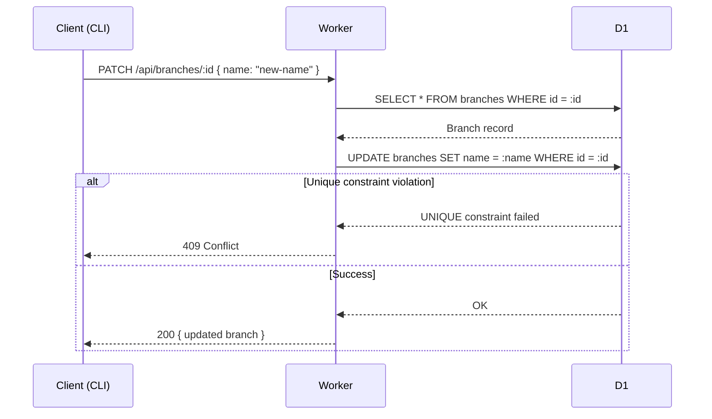
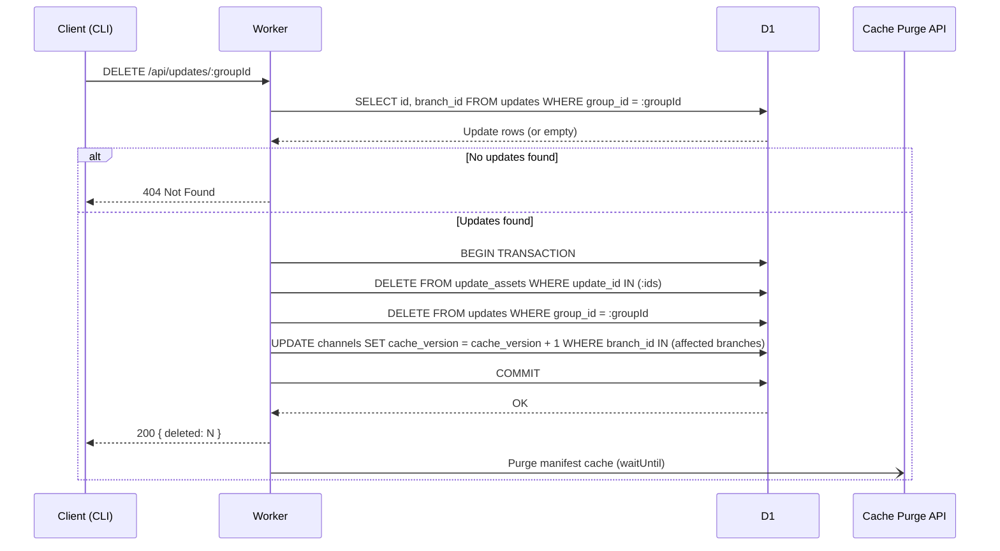

# 15. Management Extensions

Three management features to reach parity with EAS CLI: channel pause/resume, branch rename, and update deletion.

---

## 1. Channel Pause/Resume

Pause a channel to stop serving updates without deleting the channel or unlinking its branch. Paused channels return `204 No Content` to all manifest requests.

### Schema Change

Add column to `channels`:

| Column      | Type                         | Description                |
| ----------- | ---------------------------- | -------------------------- |
| `is_paused` | `INTEGER NOT NULL DEFAULT 0` | `0` = active, `1` = paused |

Migration: `ALTER TABLE channels ADD COLUMN is_paused INTEGER NOT NULL DEFAULT 0;`

### Endpoints

| Method | Path                       | Body | Effect              | Auth    |
| ------ | -------------------------- | ---- | ------------------- | ------- |
| `POST` | `/api/channels/:id/pause`  | --   | Set `is_paused = 1` | API key |
| `POST` | `/api/channels/:id/resume` | --   | Set `is_paused = 0` | API key |

Both return the updated channel record. Pausing an already-paused channel (or resuming an active one) is a no-op that returns `200` with the current state.

### Manifest Serving Impact

The pause check is inserted early in the resolution flow, after channel lookup but before update resolution:

When paused, the response is `204 No Content` with the standard protocol headers (`expo-protocol-version`, `expo-sfv-version`, `cache-control`). This is the same response as "no update available" -- the expo-updates client treats it identically.

### KV Impact

The KV value for channel mapping (`ch:{project_id}:{channel_name}`) is extended to include the pause flag:

| Field     | Current value                    | New value                                   |
| --------- | -------------------------------- | ------------------------------------------- |
| **Key**   | `ch:{project_id}:{channel_name}` | unchanged                                   |
| **Value** | `branch_id`                      | `{ branchId, isPaused, branchMappingJson }` |

Store as JSON. The manifest hot path reads the KV entry and checks `isPaused` before proceeding with branch resolution.

### Backward Compatibility

During migration, the manifest hot path must support **both** KV value formats:

1. **Legacy format** (plain string): `branch_id` — treat as `{ branchId: value, isPaused: false, branchMappingJson: null }`
2. **New format** (JSON): `{ branchId, isPaused, branchMappingJson }`

The reader attempts JSON parse first; on failure, falls back to treating the value as a plain `branch_id` string. This dual-format reader is required until all KV entries have been re-written in the new format (after TTL expiry of old entries, typically within 5 minutes).

### Cache Invalidation

| Trigger | Action                                                       |
| ------- | ------------------------------------------------------------ |
| Pause   | `KV.delete()` for channel key + Cache Purge API for manifest |
| Resume  | `KV.delete()` for channel key + Cache Purge API for manifest |

Purging on both pause and resume is necessary. A paused channel caches a `204` response; resuming must invalidate that cached `204` so the next request resolves the actual update.

### Processing Flow

### Consistency Note

Channel pause is **eventually consistent** across two independent layers:

| Layer                                   | Stale window                  | Mechanism                                                                        |
| --------------------------------------- | ----------------------------- | -------------------------------------------------------------------------------- |
| **Cache API** (manifest response cache) | In-flight requests only (~ms) | `cacheVersion` bump in cache key ensures new requests cannot match stale entries |
| **KV** (channel mapping cache)          | Up to 60 seconds              | `KV.delete()` propagation is eventually consistent across edge locations         |

**Primary correctness mechanism:** The `cacheVersion` counter (bumped atomically in D1 with the pause/resume update) is the authoritative mechanism. Since the cache version is part of the Cache API cache key, stale manifest responses are never matched — they expire naturally via LRU.

**KV is an acceleration layer, not a correctness mechanism.** After `KV.delete()`, some edge locations may continue reading a stale KV entry (with the old `isPaused` value) for up to 60 seconds. During this window, the stale KV entry may cause the Worker to skip the D1 lookup and proceed with the old state. However, the `cacheVersion` bump ensures the cached manifest response is not matched, so the Worker still rebuilds the response from D1 — which has the correct state.

**Net effect:** The effective stale window is limited to in-flight requests (milliseconds), not the KV propagation window, because the `cacheVersion` in the cache key forces a D1 re-query even if KV returns a stale value.

For emergency scenarios (e.g., a compromised update), additionally call `cache.delete()` at the handling Worker for immediate effect at the current datacenter.

---

## 2. Branch Rename

Rename a branch while preserving all linked channels, updates, and rollout configurations. Channels reference `branch_id` (not name), so relinking is not required.

### Endpoint

| Method  | Path                | Body               | Effect                   | Auth    |
| ------- | ------------------- | ------------------ | ------------------------ | ------- |
| `PATCH` | `/api/branches/:id` | `{ name: string }` | Update branch name in D1 | API key |

Returns the updated branch record.

### Validation

| Check                      | Error                           |
| -------------------------- | ------------------------------- |
| Branch exists              | `404 Not Found`                 |
| `name` is non-empty string | `400 Bad Request`               |
| Name unique within project | `409 Conflict` (duplicate name) |

Uniqueness is enforced by the existing `idx_branches_project_name` unique index. The endpoint catches the D1 constraint violation and returns `409`.

### Side Effects

| Concern                | Impact                                                                   |
| ---------------------- | ------------------------------------------------------------------------ |
| Linked channels        | Unaffected -- channels reference `branch_id`, not branch name            |
| Updates on this branch | Unaffected -- updates reference `branch_id`                              |
| Rollout configurations | Unaffected -- `branch_mapping_json` references `branchId` UUIDs          |
| Cache API              | No purge needed -- manifest cache keys use channel name, not branch name |
| KV                     | No update needed -- KV values store `branch_id`, not branch name         |

### Processing Flow

Branch rename is the simplest of the three features -- a single D1 UPDATE with no cache or KV side effects.

---

## 3. Update Deletion

Delete all updates in a group (the paired iOS + Android updates published together). Does not delete assets from R2 -- asset garbage collection is a separate concern.

### Endpoint

| Method   | Path                    | Body | Effect                                                | Auth    |
| -------- | ----------------------- | ---- | ----------------------------------------------------- | ------- |
| `DELETE` | `/api/updates/:groupId` | --   | Delete all updates and their asset mappings for group | API key |

Returns `{ deleted: number }` indicating how many update rows were removed.

### Deletion Scope

| Table           | Action                                                     |
| --------------- | ---------------------------------------------------------- |
| `update_assets` | DELETE WHERE `update_id` IN (updates being deleted)        |
| `updates`       | DELETE WHERE `group_id = :groupId`                         |
| `assets`        | **No change** -- other updates may reference these assets  |
| R2 objects      | **No change** -- orphaned R2 cleanup is a separate process |

Both deletes execute within a single D1 transaction to maintain referential integrity.

### Validation

| Check                                | Error           |
| ------------------------------------ | --------------- |
| At least one update matches group_id | `404 Not Found` |

### Impact on Active Manifests

When the deleted update was the latest on a branch, the next-most-recent update becomes active automatically. The resolution query (`ORDER BY created_at DESC, id DESC LIMIT 1`) inherently returns the new latest -- no additional logic needed.

If no updates remain on the branch for a given platform/runtimeVersion, the manifest endpoint returns `204 No Content` (existing behavior for "no update available").

### Cache Invalidation

Deletion requires aggressive cache invalidation because the deleted group may have been the latest update on one or more branches:

| Target               | Action                                                                      |
| -------------------- | --------------------------------------------------------------------------- |
| Cache API (manifest) | Purge by prefix for the project domain                                      |
| KV (channel mapping) | No change needed -- channel→branch mapping is unaffected by update deletion |

Prefix-based purge is appropriate here because a group spans two platforms (iOS + Android) and the affected branch may be linked to multiple channels. Enumerating all possible cache keys is fragile; a single prefix purge is simpler and reliable.

### Processing Flow

---

## Summary: New Endpoints

| Method   | Path                       | Body               | Feature         |
| -------- | -------------------------- | ------------------ | --------------- |
| `POST`   | `/api/channels/:id/pause`  | --                 | Channel pause   |
| `POST`   | `/api/channels/:id/resume` | --                 | Channel resume  |
| `PATCH`  | `/api/branches/:id`        | `{ name: string }` | Branch rename   |
| `DELETE` | `/api/updates/:groupId`    | --                 | Update deletion |

## Summary: Schema Changes

| Table      | Change                                     | Migration                                                              |
| ---------- | ------------------------------------------ | ---------------------------------------------------------------------- |
| `channels` | Add `is_paused INTEGER NOT NULL DEFAULT 0` | `ALTER TABLE channels ADD COLUMN is_paused INTEGER NOT NULL DEFAULT 0` |

## Summary: Cache Side Effects

| Operation       | Cache API Purge | KV Delete | KV Update |
| --------------- | --------------- | --------- | --------- |
| Channel pause   | Yes             | Yes       | No        |
| Channel resume  | Yes             | Yes       | No        |
| Branch rename   | No              | No        | No        |
| Update deletion | Yes             | No        | No        |
