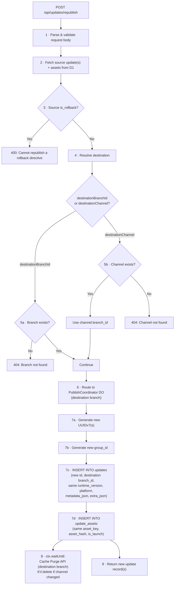
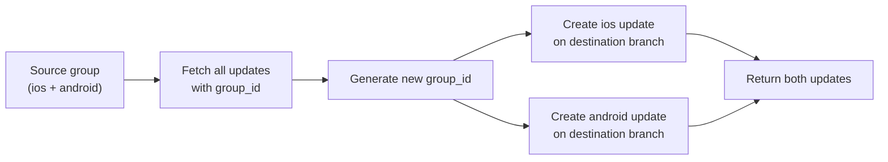

# 16. Cross-Channel Republish (Promote)

## Overview

Promote a tested update from one channel/branch to another without rebuilding. The server creates new update rows on the destination branch pointing to the same content-addressed assets — no R2 upload needed.

This extends the existing within-branch republish (spec 09) to work across branches. EAS CLI supports this via `eas update:republish --destination-channel production`.

## Endpoint

`POST /api/updates/republish` (`application/json`):

**Single update republish:**

| Field                 | Type   | Required | Description                                                    |
| --------------------- | ------ | -------- | -------------------------------------------------------------- |
| `sourceUpdateId`      | string | \*       | ID of the update to republish                                  |
| `sourceGroupId`       | string | \*       | Group ID — republish all updates in the group                  |
| `destinationBranchId` | string | \*\*     | Target branch ID                                               |
| `destinationChannel`  | string | \*\*     | Target channel name (resolved to its linked branch)            |
| `message`             | string | No       | Override publish message (defaults to source update's message) |

\* Exactly one of `sourceUpdateId` or `sourceGroupId` must be provided.

\*\* Exactly one of `destinationBranchId` or `destinationChannel` must be provided.

**Response** (`200 OK`):

```json
{
  "updates": [
    {
      "id": "<new-uuidv7>",
      "branchId": "<destination-branch-id>",
      "groupId": "<new-group-id>",
      "platform": "ios",
      "runtimeVersion": "1.0.0",
      "message": "...",
      "createdAt": "..."
    }
  ]
}
```

Auth: API key (`Authorization: Bearer <key>`).

### Code Signing Guard

When code signing is enabled for the project, `POST /api/updates/republish` returns **`400 Bad Request`** with error `"Cannot republish in a signed project. Use POST /api/updates with a pre-signed manifest instead."`

Republish creates new update records with `signature = NULL` and `certificate_chain = NULL`. Clients that expect signed manifests (`expo-expect-signature` header) will reject these unsigned updates. Rather than silently creating unverifiable updates, the endpoint rejects upfront.

Projects with code signing should use the client-side republish flow via `POST /api/updates`, where the publisher constructs and signs the full manifest before uploading.

## Processing Flow



### Transaction Boundary

Steps 7a–7d execute within a **single D1 transaction**. For group republish (multiple source updates), all new `updates` rows and their `update_assets` mappings are inserted atomically. If any insert fails, the entire republish is rolled back — no partial group is created on the destination branch.

```sql
BEGIN TRANSACTION;
-- For each source update in the group:
INSERT INTO updates (...) VALUES (...);       -- new id, destination branch
INSERT INTO update_assets (...) VALUES (...); -- copied asset mappings
COMMIT;
```

### Step Details

**Step 2 — Fetch source:**

- If `sourceUpdateId`: fetch single update + its `update_assets` rows
- If `sourceGroupId`: fetch all updates with matching `group_id` + their `update_assets` rows. Reject if group is empty (no matching updates).

**Step 4/5 — Resolve destination:**

- If `destinationBranchId`: look up branch by ID in D1. Return `404` if branch does not exist. **No auto-creation** — a branch ID references a specific existing resource; auto-creating from an ID alone is not actionable (no name available).
- If `destinationChannel`: look up channel by name in D1, use its `branch_id`. Return `404` if channel does not exist. **No auto-creation** — unlike the publish endpoint which creates branch+channel on first publish, republish targets existing infrastructure.

**Step 7 — Create new records:**

For each source update in the group:

| Field               | Value                                                    |
| ------------------- | -------------------------------------------------------- |
| `id`                | New UUIDv7                                               |
| `branch_id`         | Destination branch                                       |
| `runtime_version`   | Copied from source                                       |
| `platform`          | Copied from source                                       |
| `message`           | Override from request body, or copied from source        |
| `metadata_json`     | Copied from source                                       |
| `extra_json`        | Copied from source                                       |
| `group_id`          | New UUIDv7 (shared across all updates in this republish) |
| `is_rollback`       | `0`                                                      |
| `signature`         | `NULL` (see Code Signing Implications)                   |
| `certificate_chain` | `NULL` (see Code Signing Implications)                   |
| `created_at`        | Current timestamp                                        |

`update_assets` rows are copied verbatim — same `asset_key`, `asset_hash`, `is_launch` — pointing to the new `update_id`. No new rows in the `assets` table; no new R2 objects.

## Code Signing Implications

Signatures are **not copied** from the source update. A signature covers the exact manifest JSON (including the update ID and branch context). Since the republished update has a new ID on a different branch, the original signature is invalid for the new manifest.

Two scenarios:

| Scenario                | Behavior                                                                                                                                                                                                                                                                                                                                                    |
| ----------------------- | ----------------------------------------------------------------------------------------------------------------------------------------------------------------------------------------------------------------------------------------------------------------------------------------------------------------------------------------------------------- |
| **No code signing**     | Republish works as-is. No signature fields needed.                                                                                                                                                                                                                                                                                                          |
| **Code signing active** | The publisher must re-sign the new manifest after republish. Use the two-phase flow: republish server-side, then sign the returned manifest and update the signature via a separate endpoint (future work), or use the existing `POST /api/updates` client-side republish flow where the publisher constructs and signs the full manifest before uploading. |

For the initial implementation, `POST /api/updates/republish` is intended for projects **without** code signing. Projects with code signing should use the existing client-side republish flow via `POST /api/updates` (same as spec 09).

## Cache Impact

After republish, the destination branch/channel has new updates that must be visible immediately.

| Action                        | Trigger                                              |
| ----------------------------- | ---------------------------------------------------- |
| Cache Purge API (global)      | Purge manifest cache for destination branch/channels |
| KV.delete (if channel target) | Invalidate channel mapping if channel was resolved   |

Purge is dispatched via `ctx.waitUntil` (fire-and-forget), following the same pattern as the publish endpoint (spec 10).

## Edge Cases

| Case                                                          | Behavior                                                                                                                         |
| ------------------------------------------------------------- | -------------------------------------------------------------------------------------------------------------------------------- |
| Republish to **same branch**                                  | Equivalent to within-branch republish (spec 09). Creates a new update row.                                                       |
| Source is a **rollback directive**                            | Return `400`. Rollback directives are branch-specific and cannot be promoted.                                                    |
| **Code signing enabled** on project                           | Return `400`. Republished updates cannot carry valid signatures. Use `POST /api/updates` with pre-signed manifest.               |
| Source update **not found**                                   | Return `404`.                                                                                                                    |
| Source group **empty** (no updates)                           | Return `404`.                                                                                                                    |
| Destination branch **does not exist** (`destinationBranchId`) | Return `404`. No auto-creation — branch IDs reference specific existing resources.                                               |
| Destination channel **does not exist** (`destinationChannel`) | Return `404`. No auto-creation — republish targets existing infrastructure.                                                      |
| Destination channel has **active rollout**                    | Republish targets the channel's `branch_id` (default branch), not the rollout branch. The rollout configuration is not modified. |
| **Duplicate republish** (same source, same destination)       | Allowed. Creates another new update row. Idempotency is the caller's responsibility.                                             |
| Source and destination on **different projects**              | Not supported. Both must belong to the same project. Return `400` if mismatched.                                                 |

## Group Republish

When `sourceGroupId` is provided, the server republishes all updates in the group as an atomic operation:



All updates in the group are republished to the **same destination branch** with a **shared new group_id**. This preserves the iOS + Android pairing on the destination.

If any update in the source group is a rollback directive, the entire operation is rejected with `400`.
