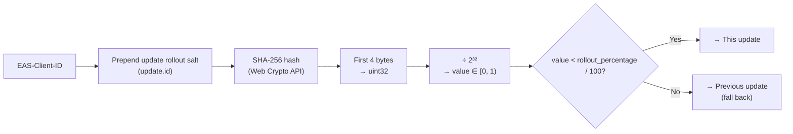
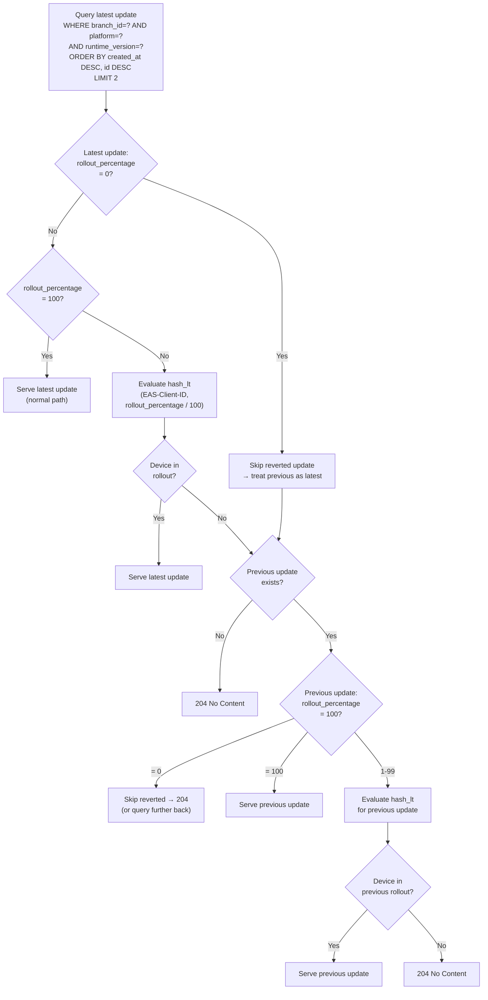
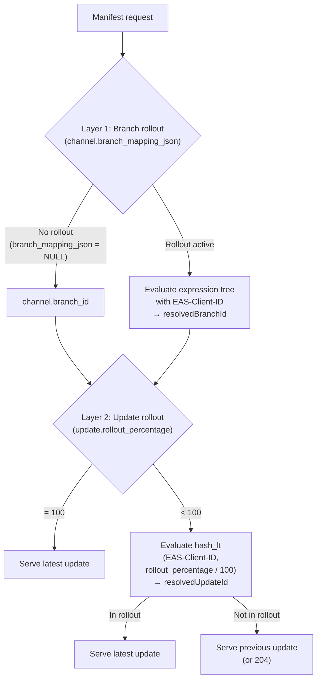
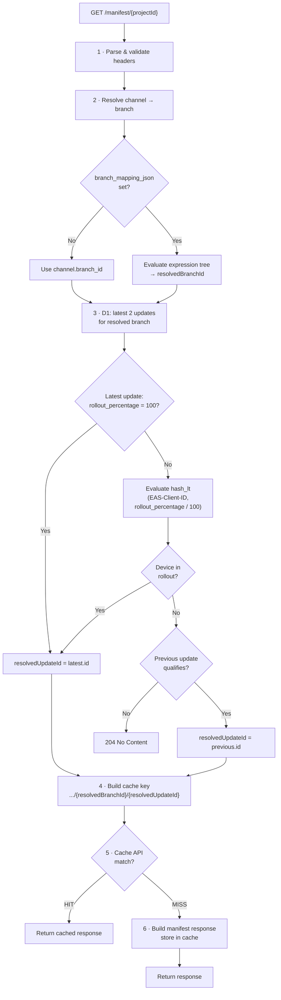

# 17. Per-Update Rollouts

## Overview

Per-update rollouts allow releasing a specific update to a percentage of users before making it available to all. Devices **not** in the rollout receive the **previous** update on the same branch. This is distinct from branch-based rollouts (spec 12), which split traffic between two branches at the channel level.

| Rollout type     | Unit                   | Stored on  | Effect                                                     |
| ---------------- | ---------------------- | ---------- | ---------------------------------------------------------- |
| **Branch-based** | Channel → two branches | `channels` | Split traffic between old and new branch                   |
| **Per-update**   | Single update          | `updates`  | Roll out one update to X% — remaining devices get previous |

Both use `hash_lt` with the same `EAS-Client-ID` but operate as independent layers.

## Schema Change

Add `rollout_percentage` to the `updates` table:

| Column               | Type    | Default | Constraint     | Description                                    |
| -------------------- | ------- | ------- | -------------- | ---------------------------------------------- |
| `rollout_percentage` | INTEGER | `100`   | `CHECK(0-100)` | Percentage of devices that receive this update |

```sql
ALTER TABLE updates ADD COLUMN rollout_percentage INTEGER NOT NULL DEFAULT 100
  CHECK (rollout_percentage >= 0 AND rollout_percentage <= 100);
```

- `100` = fully available to all devices (default, backward-compatible)
- `1`-`99` = partial rollout (active)
- `0` = reverted — update is skipped in resolution, all devices receive the previous update

## How It Works

When the latest update on a branch has `rollout_percentage < 100`, the server evaluates `hash_lt(EAS-Client-ID, rollout_percentage / 100)` — the **same algorithm** as branch-based rollouts — to decide whether the device receives this update or falls back to the previous one.



Properties (inherited from `hash_lt`):

- **Deterministic**: Same device always gets the same result for the same rollout percentage
- **Sticky on increase**: Increasing percentage from 10% to 50% retains all devices already in the rollout
- **Stateless**: No assignment table — computed on every request from the update ID + device ID

## API Endpoints

### Publish with Rollout

`POST /api/updates` accepts an optional `rolloutPercentage` field:

| Field               | Type   | Default | Description                            |
| ------------------- | ------ | ------- | -------------------------------------- |
| `rolloutPercentage` | number | `100`   | 1-100, percentage of devices to target |

When provided, the created update record has `rollout_percentage` set to the given value.

### Edit Rollout Percentage

| Method  | Endpoint                   | Body             | Effect                                    |
| ------- | -------------------------- | ---------------- | ----------------------------------------- |
| `PATCH` | `/api/updates/:id/rollout` | `{ percentage }` | Update `rollout_percentage` on the update |

Validation:

- `percentage` must be an integer 1-100
- Only the **latest** update per branch/platform/runtimeVersion can have its rollout edited (editing a non-latest update is rejected with `409 Conflict`)
- Triggers cache purge (same as publish)

### Complete Rollout (Roll Out Fully)

| Method | Endpoint                            | Body | Effect                                            |
| ------ | ----------------------------------- | ---- | ------------------------------------------------- |
| `POST` | `/api/updates/:id/rollout/complete` | —    | Set `rollout_percentage = 100` (available to all) |

Makes the update available to all devices. The rollout is ended and the update becomes the stable latest. Triggers cache version bump + cache purge.

### Revert Rollout

| Method | Endpoint                          | Body | Effect                                                         |
| ------ | --------------------------------- | ---- | -------------------------------------------------------------- |
| `POST` | `/api/updates/:id/rollout/revert` | —    | Set `rollout_percentage = 0` (all devices get previous update) |

Reverts the rollout — all devices stop receiving this update and fall back to the previous update. The update remains in the database (not deleted) but is skipped during resolution. Triggers cache version bump + cache purge.

**"Complete" vs "Revert" are fundamentally different operations:**

| Action       | Effect on this update      | Effect on devices                    |
| ------------ | -------------------------- | ------------------------------------ |
| **Complete** | `rollout_percentage = 100` | All devices receive this update      |
| **Revert**   | `rollout_percentage = 0`   | All devices receive the previous one |

### Same-Runtime Publish Blocking

While a per-update rollout is active (`1 <= rollout_percentage <= 99`), new publishes to the same branch/platform/runtimeVersion are rejected with `409 Conflict`. The publisher must first complete or revert the active rollout before publishing a new update. See [spec 06](./06-publishing.md#same-runtime-publish-blocking).

## Resolution Algorithm

### Update Resolution with Per-Update Rollout

When resolving the latest update for a branch, the server must account for partial rollouts:



### Fallback Resolution

When the latest update has `rollout_percentage < 100` and the device is not in the rollout, the server falls back to the most recent **fully-rolled-out** update (one with `rollout_percentage = 100`).

```sql
-- Primary query: latest 2 updates (covers common case)
SELECT * FROM updates
WHERE branch_id = ? AND platform = ? AND runtime_version = ?
ORDER BY created_at DESC, id DESC
LIMIT 2
```

If the second row also has `rollout_percentage < 100` or `= 0`, the server issues a **targeted fallback query** for the most recent fully-available update:

```sql
-- Fallback: find latest fully-rolled-out update (skip reverted ones)
SELECT * FROM updates
WHERE branch_id = ? AND platform = ? AND runtime_version = ?
  AND rollout_percentage = 100
ORDER BY created_at DESC, id DESC
LIMIT 1
```

This ensures a valid update is always found if one exists, regardless of how many partial or reverted rollouts exist in succession. If no fully-available update exists, the server returns `204 No Content`.

**Optimization:** The common case (latest is 100%, or latest is partial + previous is 100%) is handled by the first `LIMIT 2` query. The fallback query is only issued in the rare case of consecutive partial rollouts.

## Two-Layer Rollout Interaction

Branch-based and per-update rollouts are two independent layers evaluated in sequence:



| Layer | Input             | Decision                  | Output             |
| ----- | ----------------- | ------------------------- | ------------------ |
| 1     | Channel + headers | Which **branch** to serve | `resolvedBranchId` |
| 2     | Branch + headers  | Which **update** to serve | `resolvedUpdateId` |

The two layers are **sequential but uncorrelated**. Each layer uses `hash_lt` with the `EAS-Client-ID`, but with a **different salt** — branch rollouts use the branch mapping ID, per-update rollouts use the update ID. Different salts produce independent hash values, so a device's assignment in layer 1 does not predict its assignment in layer 2. A device can be in the branch rollout group but not the update rollout group, or vice versa.

## Caching Impact

Per-update rollouts produce **at most 2 possible update IDs** for a given branch/platform/runtimeVersion (the rolled-out update or the previous update). To cache both variants, the resolved update ID is appended to the cache key.

### Cache Key Structure

```
/_cache/manifest/{projectId}/{channel}/{platform}/{runtimeVersion}[/{resolvedBranchId}][/{resolvedUpdateId}]
```

| Segment            | Present when                       | Possible values         |
| ------------------ | ---------------------------------- | ----------------------- |
| `resolvedBranchId` | Branch rollout active on channel   | 2 (old or new branch)   |
| `resolvedUpdateId` | Per-update rollout active (< 100%) | 2 (current or previous) |

### Worst-Case Cache Entries

| Scenario                | Branch variants | Update variants | Total cache entries |
| ----------------------- | --------------- | --------------- | ------------------- |
| No rollouts             | 1               | 1               | **1**               |
| Branch rollout only     | 2               | 1               | **2**               |
| Per-update rollout only | 1               | 2               | **2**               |
| Both rollouts active    | 2               | 2               | **4**               |

4 cache entries per channel/platform/runtimeVersion is the worst case — still efficient and bounded.

### Resolution Order

The rollout evaluations (`hash_lt`) are cheap (~0.1ms each), so the overhead of evaluating both layers before checking cache is negligible:

1. Evaluate Layer 1 (branch rollout) → `resolvedBranchId`
2. Evaluate Layer 2 (update rollout) → `resolvedUpdateId`
3. Build cache key with both resolved IDs
4. Check Cache API → on hit, return immediately
5. On miss: query D1, build response, store in cache

Both rollout evaluations happen **before** the cache lookup so the cache key is fully determined.

### Cache Invalidation

Editing a rollout percentage triggers the same cache purge as publishing. Since the `resolvedUpdateId` segment changes based on which update a device qualifies for, all cached variants for the affected branch/platform/runtimeVersion must be purged.

## Updated Manifest Resolution (Full Flow)

The complete resolution algorithm with both rollout layers:



**Note on query ordering:** The D1 query (step 3) happens **before** the cache check (step 5) because the resolved update ID — needed for the cache key — depends on evaluating the update's `rollout_percentage`. However, the query fetches at most 2 rows from an indexed table, adding minimal latency (~2-3ms). The cache key now fully determines the response, so subsequent requests for the same device bucket hit cache directly.

## Performance Impact

| Step                             | Cost           | Notes                        |
| -------------------------------- | -------------- | ---------------------------- |
| `hash_lt` evaluation (per layer) | ~0.1ms         | Single SHA-256 + comparison  |
| D1 query (LIMIT 2 vs LIMIT 1)    | +0.1-0.5ms     | Same index, one extra row    |
| Cache entries (worst case)       | 4 per variant  | Bounded, self-expiring       |
| Total overhead vs no rollout     | ~0.5ms on miss | Amortized to ~0 on cache hit |
