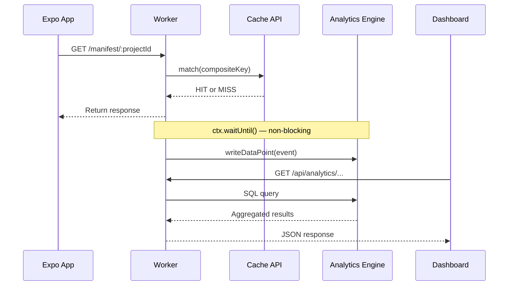
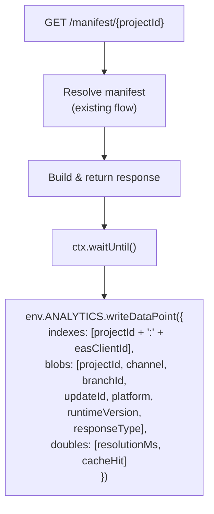

# 18. Deployment Analytics

## Overview

Deployment analytics tracks manifest request events to provide update adoption rates, download counts, platform splits, and channel health metrics. Built on **Cloudflare Workers Analytics Engine (WAE)** — a purpose-built service for high-volume event tracking from Workers.

WAE is the right choice because:

- **Non-blocking writes** — `writeDataPoint()` adds zero latency to the manifest hot path
- **No D1 contention** — D1 is single-threaded SQLite, unsuitable for high-volume analytics writes or concurrent dashboard queries
- **Automatic sampling** — handles traffic spikes without data loss or performance degradation
- **SQL query API** — supports aggregations, time-series grouping, and filtering without JOINs

**Constraints:** 92-day retention, no JOINs/UNIONs (single dataset queries only), automatic sampling at high volume requires `SUM(_sample_interval)` instead of `COUNT(*)`.

## Data Flow



## Wrangler Configuration

Add to `apps/api/wrangler.jsonc`:

| Type             | Binding Name | Dataset         |
| ---------------- | ------------ | --------------- |
| Analytics Engine | `ANALYTICS`  | `update_events` |

```jsonc
{
  "analytics_engine_datasets": [{ "binding": "ANALYTICS", "dataset": "update_events" }],
}
```

## Event Schema

Each manifest request produces one data point via `env.ANALYTICS.writeDataPoint()`.

### Index (sampling key)

| Field   | Format                      | Purpose                                                               |
| ------- | --------------------------- | --------------------------------------------------------------------- |
| `index` | `{projectId}:{easClientId}` | Ensures per-device sampling fairness — WAE samples uniformly by index |

When `EAS-Client-ID` header is absent, fall back to `{projectId}:anonymous`. This groups all anonymous requests under one sampling key per project.

### Blobs (string fields)

| Slot    | Field            | Source                                    | Example                                  |
| ------- | ---------------- | ----------------------------------------- | ---------------------------------------- |
| `blob1` | `projectId`      | URL path parameter                        | `01J5K...`                               |
| `blob2` | `channelName`    | `expo-channel-name` header                | `production`                             |
| `blob3` | `branchId`       | Resolved branch ID                        | `01J5K...`                               |
| `blob4` | `updateId`       | Resolved update ID (or `""` if no update) | `01J5K...`                               |
| `blob5` | `platform`       | `expo-platform` header                    | `ios`                                    |
| `blob6` | `runtimeVersion` | `expo-runtime-version` header             | `1.0.0`                                  |
| `blob7` | `responseType`   | Response classification                   | `manifest` \| `directive` \| `no_update` |

### Doubles (numeric fields)

| Slot      | Field          | Purpose                        |
| --------- | -------------- | ------------------------------ |
| `double1` | `resolutionMs` | Total manifest resolution time |
| `double2` | `cacheHit`     | `1` = cache hit, `0` = miss    |

## Tracking Integration

The analytics write happens in the manifest serving hot path, inside `ctx.waitUntil()` to avoid blocking the response.



**Integration point:** After the response is determined but before returning. The `responseType` is derived from the resolution result:

| Resolution Result           | `responseType` |
| --------------------------- | -------------- |
| Update found, manifest sent | `manifest`     |
| Rollback directive sent     | `directive`    |
| No update (204)             | `no_update`    |

**Limits:** Max 250 `writeDataPoint()` calls per Worker invocation. Since manifest requests produce exactly 1 data point, this is never a concern.

## Dashboard API Endpoints

New management API endpoints that proxy to the WAE SQL API.

| Method | Path                       | Purpose                             | Auth    |
| ------ | -------------------------- | ----------------------------------- | ------- |
| GET    | `/api/analytics/adoption`  | Adoption rate per update            | API key |
| GET    | `/api/analytics/updates`   | Download/apply counts for an update | API key |
| GET    | `/api/analytics/channels`  | Channel-level metrics               | API key |
| GET    | `/api/analytics/platforms` | Platform split breakdown            | API key |

### GET /api/analytics/adoption

Adoption rate: unique devices that received each update.

| Param       | Type   | Required | Default | Description                           |
| ----------- | ------ | -------- | ------- | ------------------------------------- |
| `projectId` | string | Yes      | —       | Project to query                      |
| `period`    | string | No       | `7d`    | Time window: `1d`, `7d`, `30d`, `90d` |

Response:

```json
{
  "updates": [
    {
      "updateId": "01J5K...",
      "devices": 12450,
      "firstSeen": "2026-03-25T10:00:00Z",
      "lastSeen": "2026-03-29T18:00:00Z"
    }
  ]
}
```

### GET /api/analytics/updates

Metrics for a specific update.

| Param       | Type   | Required | Description                |
| ----------- | ------ | -------- | -------------------------- |
| `projectId` | string | Yes      | Project to query           |
| `updateId`  | string | Yes      | Update to query            |
| `period`    | string | No       | Time window (default `7d`) |

Response:

```json
{
  "updateId": "01J5K...",
  "totalRequests": 45200,
  "uniqueDevices": 12450,
  "byResponseType": {
    "manifest": 38000,
    "directive": 200,
    "no_update": 7000
  },
  "timeSeries": [{ "timestamp": "2026-03-25T00:00:00Z", "requests": 6400 }]
}
```

### GET /api/analytics/channels

Channel-level health metrics.

| Param       | Type   | Required | Description                |
| ----------- | ------ | -------- | -------------------------- |
| `projectId` | string | Yes      | Project to query           |
| `channel`   | string | Yes      | Channel name               |
| `period`    | string | No       | Time window (default `7d`) |

Response:

```json
{
  "channel": "production",
  "totalRequests": 120000,
  "uniqueDevices": 35000,
  "responseTypeDistribution": {
    "manifest": 95000,
    "directive": 500,
    "no_update": 24500
  }
}
```

### GET /api/analytics/platforms

Platform split breakdown.

| Param       | Type   | Required | Description                |
| ----------- | ------ | -------- | -------------------------- |
| `projectId` | string | Yes      | Project to query           |
| `period`    | string | No       | Time window (default `7d`) |

Response:

```json
{
  "platforms": [
    { "platform": "ios", "requests": 72000, "devices": 21000 },
    { "platform": "android", "requests": 48000, "devices": 14000 }
  ]
}
```

## Example Queries

### Sampling Accuracy Note

WAE automatically samples at high volume. This affects query accuracy:

| Metric type       | Correct approach         | Accuracy            |
| ----------------- | ------------------------ | ------------------- |
| **Total counts**  | `SUM(_sample_interval)`  | Exact (compensated) |
| **Unique counts** | `COUNT(DISTINCT index1)` | **Approximate**     |

`COUNT(DISTINCT ...)` under sampling is biased low — it counts only distinct values in the sampled subset. Unique device counts should be treated as **approximate lower bounds**, not exact figures. For precise unique counts at scale, consider HyperLogLog estimation or external analytics pipelines.

All queries use the WAE SQL API. **Critical: use `SUM(_sample_interval)` instead of `COUNT(*)` for accurate results** — WAE automatically samples at high volume and `_sample_interval` compensates for it.

### Adoption rate per update (unique devices)

```sql
SELECT
  blob4 AS updateId,
  SUM(_sample_interval) AS total_requests,
  COUNT(DISTINCT index1) AS unique_devices,
  MIN(timestamp) AS first_seen,
  MAX(timestamp) AS last_seen
FROM update_events
WHERE
  blob1 = '{projectId}'
  AND blob7 = 'manifest'
  AND timestamp > NOW() - INTERVAL '7' DAY
GROUP BY blob4
ORDER BY first_seen DESC
```

### Download trend (time-series by hour)

```sql
SELECT
  toStartOfHour(timestamp) AS hour,
  SUM(_sample_interval) AS requests
FROM update_events
WHERE
  blob1 = '{projectId}'
  AND blob4 = '{updateId}'
  AND blob7 = 'manifest'
  AND timestamp > NOW() - INTERVAL '7' DAY
GROUP BY hour
ORDER BY hour ASC
```

### Channel health (response type distribution)

```sql
SELECT
  blob7 AS response_type,
  SUM(_sample_interval) AS count
FROM update_events
WHERE
  blob1 = '{projectId}'
  AND blob2 = '{channelName}'
  AND timestamp > NOW() - INTERVAL '7' DAY
GROUP BY blob7
ORDER BY count DESC
```

### Platform split

```sql
SELECT
  blob5 AS platform,
  SUM(_sample_interval) AS requests,
  COUNT(DISTINCT index1) AS unique_devices
FROM update_events
WHERE
  blob1 = '{projectId}'
  AND timestamp > NOW() - INTERVAL '7' DAY
GROUP BY blob5
ORDER BY requests DESC
```

### Update adoption over time (daily unique devices)

```sql
SELECT
  toStartOfDay(timestamp) AS day,
  blob4 AS updateId,
  COUNT(DISTINCT index1) AS unique_devices
FROM update_events
WHERE
  blob1 = '{projectId}'
  AND blob7 = 'manifest'
  AND timestamp > NOW() - INTERVAL '30' DAY
GROUP BY day, blob4
ORDER BY day ASC
```

## Cost Estimate

Based on 1M daily active devices (same assumptions as [Architecture](./01-architecture.md#cost-model-at-scale)):

| Component                           | Monthly Volume | Cost                            |
| ----------------------------------- | -------------- | ------------------------------- |
| WAE writes (1 per manifest request) | 30M            | $5.00 (after 10M free included) |
| WAE reads (dashboard queries)       | ~10K           | Free (within 1M free tier)      |
| **Total**                           |                | **~$5/month**                   |

Dashboard queries are negligible — a small team checking analytics a few times per day generates far fewer than 1M reads/month.

## Privacy Considerations

The `EAS-Client-ID` is a per-install UUID that uniquely identifies a device. When written to WAE as part of the index field, it enables per-device tracking across all manifest requests.

**Recommendation:** If raw per-device identifiers are not strictly needed for analytics, HMAC the `EAS-Client-ID` before writing:

```
index = projectId + ":" + HMAC-SHA256(analyticsSecret, easClientId)
```

This preserves uniqueness for `COUNT(DISTINCT)` queries while preventing correlation with the raw device ID. The `analyticsSecret` is a per-project secret stored as a Worker secret.

If raw tracking is acceptable for the deployment, document this in the project's privacy policy.

## What WAE Does NOT Replace

| Concern                | Service | Reason                                                    |
| ---------------------- | ------- | --------------------------------------------------------- |
| Metadata storage       | D1      | WAE has 92-day retention, no relations, no point lookups  |
| Channel/branch mapping | KV      | WAE is write-only from Workers, no key-value read pattern |
| Asset storage          | R2      | WAE stores numbers and short strings, not binary blobs    |
| Publish coordination   | DO      | WAE is append-only analytics, not transactional state     |
