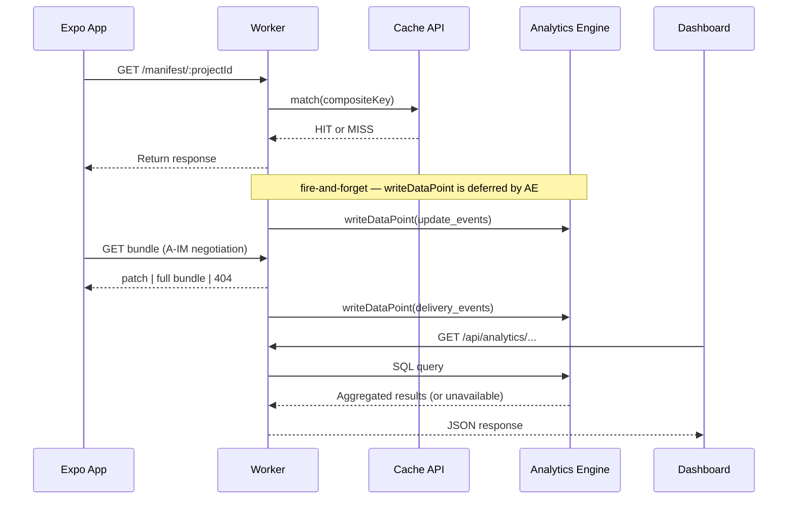
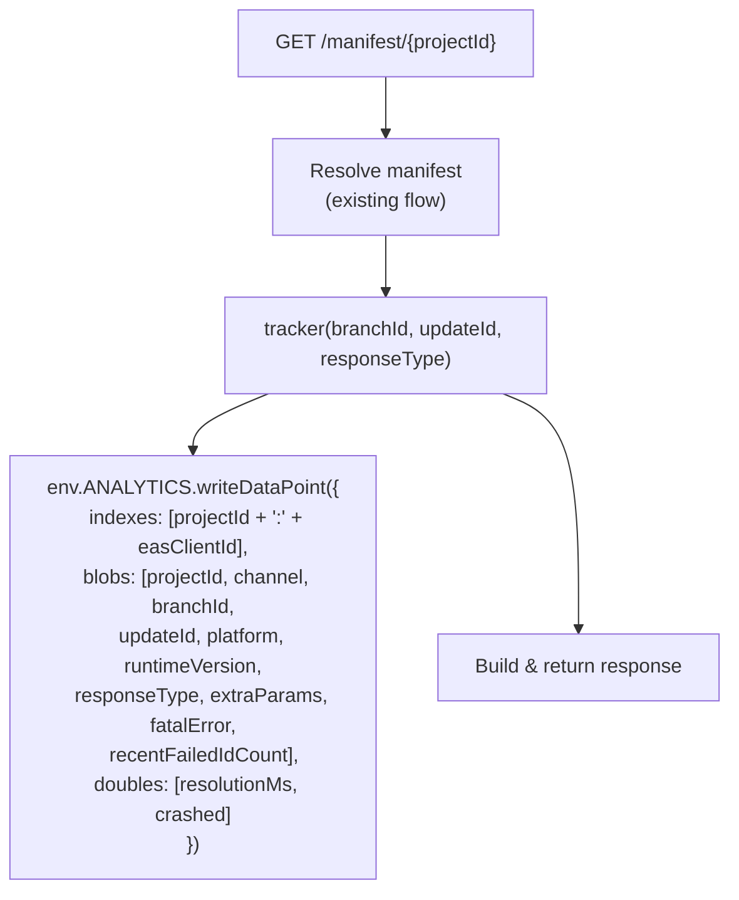

# 18. Deployment Analytics

## Overview

Deployment analytics tracks two event streams — manifest checks and bundle downloads — to
provide update adoption rates, download counts, patch hit-rate, platform splits, and
channel health metrics. Built on **Cloudflare Workers Analytics Engine (WAE)** — a
purpose-built service for high-volume event tracking from Workers.

WAE is the right choice because:

- **Non-blocking writes** — `writeDataPoint()` adds zero latency to the manifest hot path
- **No D1 contention** — D1 is single-threaded SQLite, unsuitable for high-volume analytics writes or concurrent dashboard queries
- **Automatic sampling** — handles traffic spikes without data loss or performance degradation
- **SQL query API** — supports aggregations, time-series grouping, and filtering without JOINs

**Constraints:** 92-day retention, no JOINs/UNIONs (single dataset queries only), automatic sampling at high volume requires `SUM(_sample_interval)` instead of `COUNT(*)`.

## Data Flow


```mermaid
sequenceDiagram
    participant App as Expo App
    participant W as Worker
    participant Cache as Cache API
    participant WAE as Analytics Engine
    participant Dash as Dashboard

    App->>W: GET /manifest/:projectId
    W->>Cache: match(compositeKey)
    Cache-->>W: HIT or MISS
    W-->>App: Return response

    Note over W,WAE: fire-and-forget — writeDataPoint is deferred by AE
    W->>WAE: writeDataPoint(update_events)

    App->>W: GET bundle (A-IM negotiation)
    W-->>App: patch | full bundle | 404
    W->>WAE: writeDataPoint(delivery_events)

    Dash->>W: GET /api/analytics/...
    W->>WAE: SQL query
    WAE-->>W: Aggregated results (or unavailable)
    W-->>Dash: JSON response
```

## Wrangler Configuration

Two datasets, rendered from the deploy config (`config/wrangler/server.ts`). They stay
separate because the event shapes have nothing in common and WAE cannot JOIN or UNION
across datasets — merging them would force a discriminator filter into every query.

| Type             | Binding              | Dataset var                     | Default           | Written by     |
| ---------------- | -------------------- | ------------------------------- | ----------------- | -------------- |
| Analytics Engine | `ANALYTICS`          | `BU_ANALYTICS_DATASET`          | `update_events`   | manifest route |
| Analytics Engine | `DELIVERY_ANALYTICS` | `BU_DELIVERY_ANALYTICS_DATASET` | `delivery_events` | bundle route   |

```jsonc
{
  "analytics_engine_datasets": [
    { "binding": "ANALYTICS", "dataset": "update_events" },
    { "binding": "DELIVERY_ANALYTICS", "dataset": "delivery_events" },
  ],
}
```

The bindings name the datasets for **writes**. The SQL API takes the dataset as a table
name, so the same names are also published as the `ANALYTICS_DATASET` /
`DELIVERY_ANALYTICS_DATASET` vars and read back by `cloudflare/analytics-engine.ts` —
otherwise an instance that renamed a dataset would write to one table and query another.
A name that is not a plain `[A-Za-z0-9_]` identifier falls back to the built-in default
rather than reaching the SQL API.

### Reading requires a secret

Writes need no credential. **Reads** go through the account-level Analytics Engine SQL
API and need a `CLOUDFLARE_API_TOKEN` worker secret with **Account → Account Analytics →
Read**. Without it every query fails and the endpoints report `unavailable` (below).

## Event Schema — `update_events`

Each manifest request produces one data point via `env.ANALYTICS.writeDataPoint()`.

### Index (sampling key)

| Field   | Format                      | Purpose                                                               |
| ------- | --------------------------- | --------------------------------------------------------------------- |
| `index` | `{projectId}:{easClientId}` | Ensures per-device sampling fairness — WAE samples uniformly by index |

When the `EAS-Client-ID` header is absent the index is `{projectId}:anonymous` — ONE
bucket per project. A random id per request would make every header-less request its own
`COUNT(DISTINCT index1)` row, so a build shipped without the header would report unique
devices equal to its request count. Collapsing them under-counts instead, which is the
honest direction.

`easClientId` is clamped to 58 chars at parse (`protocol/headers.ts`) so the composite
stays inside the 96-byte AE index cap.

### Blobs (string fields)

| Slot     | Field                 | Source                                    | Example                                  |
| -------- | --------------------- | ----------------------------------------- | ---------------------------------------- |
| `blob1`  | `projectId`           | URL path parameter                        | `01J5K...`                               |
| `blob2`  | `channelName`         | `expo-channel-name` header                | `production`                             |
| `blob3`  | `branchId`            | Resolved branch ID                        | `01J5K...`                               |
| `blob4`  | `updateId`            | Resolved update ID (or `""` if no update) | `01J5K...`                               |
| `blob5`  | `platform`            | `expo-platform` header                    | `ios`                                    |
| `blob6`  | `runtimeVersion`      | `expo-runtime-version` header             | `1.0.0`                                  |
| `blob7`  | `responseType`        | Response classification                   | `manifest` \| `directive` \| `no_update` |
| `blob8`  | `extraParams`         | `expo-extra-params` header (raw SFV)      | `branch-name="main"`                     |
| `blob9`  | `fatalError`          | `Expo-Fatal-Error` header, 1024-clamped   | `TypeError: ...`                         |
| `blob10` | `recentFailedIdCount` | Length of `Expo-Recent-Failed-Update-IDs` | `2`                                      |

Slots 8–10 carry the anti-brick signals: they ride the existing hot path rather than
adding a D1 column or a second write.

### Doubles (numeric fields)

| Slot      | Field          | Purpose                                                    |
| --------- | -------------- | ---------------------------------------------------------- |
| `double1` | `resolutionMs` | Total manifest resolution time                             |
| `double2` | `crashed`      | `1` when the device reported a prior fatal error, else `0` |

## Event Schema — `delivery_events`

The manifest dataset records what a device was **told**. The bundle download is a
separate request with its own A-IM negotiation, so only this dataset records what
actually crossed the wire. Written fire-and-forget from `handlers/bundle.ts` via
`cloudflare/delivery-runtime.ts`.

Non-launch assets are served straight from the CDN and are genuinely unobservable here.
The launch bundle is not: the manifest deliberately points it at the Worker so bsdiff
negotiation can happen.

| Slot    | Field                           | Notes                                   |
| ------- | ------------------------------- | --------------------------------------- |
| `index` | `{projectId}:{currentUpdateId}` | `:anonymous` when the header is absent  |
| `blob1` | `projectId`                     |                                         |
| `blob2` | `updateId`                      | The update being fetched                |
| `blob3` | `platform`                      | `""` before expo-updates 56.0.6         |
| `blob4` | `deliveryKind`                  | `patch` \| `full` \| `not_found`        |
| `blob5` | `runtimeVersion`                | `""` before expo-updates 56.0.6         |
| `blob6` | `baseUpdateId`                  | Patch base; `""` for full and 404       |
| `blob7` | `bsdiffCapable`                 | `1` when the client sent `a-im: bsdiff` |

| Slot      | Field       | Purpose                                        |
| --------- | ----------- | ---------------------------------------------- |
| `double1` | `bytes`     | Bytes sent — `0` for a 404, which sent no body |
| `double2` | `elapsedMs` | Resolution time for the download request       |

`blob7` is the hit-rate denominator: patch hit-rate is patches served over requests that
could have taken one, and without it that denominator is unknowable.

## Read path and availability

Every analytics endpoint answers **200 even when the read path is down** — a telemetry
outage must not take the dashboard with it — and flags it with `unavailable: true` on
the result. The zeros then mean "not asked", not "not found".

This distinction is load-bearing. Collapsing a failed query into an empty row set made a
missing `CLOUDFLARE_API_TOKEN` indistinguishable from a project no device has ever
checked into: both drew "No analytics yet", and the deployment looked like it was not
using Analytics Engine at all.

| Layer                            | Behaviour                                                      |
| -------------------------------- | -------------------------------------------------------------- |
| `cloudflare/analytics-engine.ts` | Fails with `AnalyticsUnavailable`; logs `reason` (HTTP status) |
| `repositories/analytics.ts`      | Catches it, returns the empty model with `unavailable: true`   |
| Dashboard                        | "Analytics unavailable", not "No analytics in this period"     |
| CLI                              | Prints the reason in place of the empty-table line             |

## Tracking Integration

The analytics write happens in the manifest serving hot path, fire-and-forget. No
`ctx.waitUntil()` is needed — `writeDataPoint` is deferred by Analytics Engine design and
returns immediately.


```mermaid
flowchart TD
    Start["GET /manifest/{projectId}"] --> Resolve["Resolve manifest<br/>(existing flow)"]
    Resolve --> Track["tracker(branchId, updateId, responseType)"]
    Track --> Write["env.ANALYTICS.writeDataPoint({<br/>  indexes: [projectId + ':' + easClientId],<br/>  blobs: [projectId, channel, branchId,<br/>    updateId, platform, runtimeVersion,<br/>    responseType, extraParams, fatalError,<br/>    recentFailedIdCount],<br/>  doubles: [resolutionMs, crashed]<br/>})"]
    Track --> Response["Build & return response"]
```

Both trackers wrap the write in `try/catch`. `writeDataPoint` can throw synchronously on
an AE limit violation, and a throw escaping the tracker would surface as an Effect defect
and 500 the manifest path. Telemetry may never fail serving.

**Integration point:** After the response is determined but before returning. The `responseType` is derived from the resolution result:

| Resolution Result           | `responseType` |
| --------------------------- | -------------- |
| Update found, manifest sent | `manifest`     |
| Rollback directive sent     | `directive`    |
| No update (204)             | `no_update`    |

**Limits:** Max 250 `writeDataPoint()` calls per Worker invocation. Since manifest requests produce exactly 1 data point, this is never a concern.

## Dashboard API Endpoints

New management API endpoints that proxy to the WAE SQL API.

| Method | Path                       | Purpose                        | Dataset           | Auth    |
| ------ | -------------------------- | ------------------------------ | ----------------- | ------- |
| GET    | `/api/analytics/adoption`  | Adoption rate per update       | `update_events`   | API key |
| GET    | `/api/analytics/updates`   | Request counts for an update   | `update_events`   | API key |
| GET    | `/api/analytics/channels`  | Channel-level metrics          | `update_events`   | API key |
| GET    | `/api/analytics/platforms` | Platform split breakdown       | `update_events`   | API key |
| GET    | `/api/analytics/downloads` | Bundle delivery: patch vs full | `delivery_events` | API key |

Every response carries `unavailable: boolean` — see [Read path and availability](#read-path-and-availability).

### GET /api/analytics/adoption

Adoption rate: unique devices that received each update.

| Param       | Type   | Required | Default | Description                           |
| ----------- | ------ | -------- | ------- | ------------------------------------- |
| `projectId` | string | Yes      | —       | Project to query                      |
| `period`    | string | No       | `7d`    | Time window: `1d`, `7d`, `30d`, `90d` |

Response:

```json
{
  "updates": [
    {
      "updateId": "01J5K...",
      "devices": 12450,
      "firstSeen": "2026-03-25T10:00:00Z",
      "lastSeen": "2026-03-29T18:00:00Z"
    }
  ]
}
```

### GET /api/analytics/updates

Metrics for a specific update.

| Param       | Type   | Required | Description                |
| ----------- | ------ | -------- | -------------------------- |
| `projectId` | string | Yes      | Project to query           |
| `updateId`  | string | Yes      | Update to query            |
| `period`    | string | No       | Time window (default `7d`) |

Response:

```json
{
  "updateId": "01J5K...",
  "totalRequests": 45200,
  "uniqueDevices": 12450,
  "byResponseType": {
    "manifest": 38000,
    "directive": 200,
    "no_update": 7000
  },
  "timeSeries": [{ "timestamp": "2026-03-25T00:00:00Z", "requests": 6400 }]
}
```

### GET /api/analytics/channels

Channel-level health metrics.

| Param       | Type   | Required | Description                |
| ----------- | ------ | -------- | -------------------------- |
| `projectId` | string | Yes      | Project to query           |
| `channel`   | string | Yes      | Channel name               |
| `period`    | string | No       | Time window (default `7d`) |

Response:

```json
{
  "channel": "production",
  "totalRequests": 120000,
  "uniqueDevices": 35000,
  "responseTypeDistribution": {
    "manifest": 95000,
    "directive": 500,
    "no_update": 24500
  }
}
```

### GET /api/analytics/platforms

Platform split breakdown.

| Param       | Type   | Required | Description                |
| ----------- | ------ | -------- | -------------------------- |
| `projectId` | string | Yes      | Project to query           |
| `period`    | string | No       | Time window (default `7d`) |

Response:

```json
{
  "platforms": [
    { "platform": "ios", "requests": 72000, "devices": 21000 },
    { "platform": "android", "requests": 48000, "devices": 14000 }
  ],
  "unavailable": false
}
```

### GET /api/analytics/downloads

What the bundle route served. A manifest check and a bundle download are separate
requests: a device already on the latest update checks and downloads nothing.

| Param       | Type   | Required | Description                |
| ----------- | ------ | -------- | -------------------------- |
| `projectId` | string | Yes      | Project to query           |
| `period`    | string | No       | Time window (default `7d`) |

```json
{
  "downloads": 40000,
  "patchDownloads": 31000,
  "fullDownloads": 9000,
  "notFound": 12,
  "bytesServed": 84000000000,
  "patchEligibleRequests": 38000,
  "unavailable": false
}
```

`patchDownloads / patchEligibleRequests` is the patch hit-rate. `notFound` counts
requests for an unknown update or a mismatched runtime version; they sent no body and
are excluded from both `downloads` and `bytesServed`.

## Example Queries

### Sampling Accuracy Note

WAE automatically samples at high volume. This affects query accuracy:

| Metric type       | Correct approach         | Accuracy            |
| ----------------- | ------------------------ | ------------------- |
| **Total counts**  | `SUM(_sample_interval)`  | Exact (compensated) |
| **Unique counts** | `COUNT(DISTINCT index1)` | **Approximate**     |

`COUNT(DISTINCT ...)` under sampling is biased low — it counts only distinct values in the sampled subset. Unique device counts should be treated as **approximate lower bounds**, not exact figures. For precise unique counts at scale, consider HyperLogLog estimation or external analytics pipelines.

All queries use the WAE SQL API. **Critical: use `SUM(_sample_interval)` instead of `COUNT(*)` for accurate results** — WAE automatically samples at high volume and `_sample_interval` compensates for it.

### Adoption rate per update (unique devices)

```sql
SELECT
  blob4 AS updateId,
  SUM(_sample_interval) AS total_requests,
  COUNT(DISTINCT index1) AS unique_devices,
  MIN(timestamp) AS first_seen,
  MAX(timestamp) AS last_seen
FROM update_events
WHERE
  blob1 = '{projectId}'
  AND blob7 = 'manifest'
  AND timestamp > NOW() - INTERVAL '7' DAY
GROUP BY blob4
ORDER BY first_seen DESC
```

### Download trend (time-series by hour)

```sql
SELECT
  toStartOfHour(timestamp) AS hour,
  SUM(_sample_interval) AS requests
FROM update_events
WHERE
  blob1 = '{projectId}'
  AND blob4 = '{updateId}'
  AND blob7 = 'manifest'
  AND timestamp > NOW() - INTERVAL '7' DAY
GROUP BY hour
ORDER BY hour ASC
```

### Channel health (response type distribution)

```sql
SELECT
  blob7 AS response_type,
  SUM(_sample_interval) AS count
FROM update_events
WHERE
  blob1 = '{projectId}'
  AND blob2 = '{channelName}'
  AND timestamp > NOW() - INTERVAL '7' DAY
GROUP BY blob7
ORDER BY count DESC
```

### Platform split

```sql
SELECT
  blob5 AS platform,
  SUM(_sample_interval) AS requests,
  COUNT(DISTINCT index1) AS unique_devices
FROM update_events
WHERE
  blob1 = '{projectId}'
  AND timestamp > NOW() - INTERVAL '7' DAY
GROUP BY blob5
ORDER BY requests DESC
```

### Bundle delivery split (patch vs full, bytes served)

```sql
SELECT
  blob4 AS delivery_kind,
  SUM(_sample_interval) AS count,
  SUM(double1 * _sample_interval) AS bytes
FROM delivery_events
WHERE
  blob1 = '{projectId}'
  AND timestamp > NOW() - INTERVAL '7' DAY
GROUP BY blob4
```

### Patch hit-rate denominator (bsdiff-capable requests)

```sql
SELECT SUM(_sample_interval) AS eligible
FROM delivery_events
WHERE
  blob1 = '{projectId}'
  AND blob7 = '1'
  AND timestamp > NOW() - INTERVAL '7' DAY
```

### Update adoption over time (daily unique devices)

```sql
SELECT
  toStartOfDay(timestamp) AS day,
  blob4 AS updateId,
  COUNT(DISTINCT index1) AS unique_devices
FROM update_events
WHERE
  blob1 = '{projectId}'
  AND blob7 = 'manifest'
  AND timestamp > NOW() - INTERVAL '30' DAY
GROUP BY day, blob4
ORDER BY day ASC
```

## Cost Estimate

Based on 1M daily active devices (same assumptions as [Architecture](./01-architecture.md#cost-model-at-scale)):

| Component                           | Monthly Volume | Cost                            |
| ----------------------------------- | -------------- | ------------------------------- |
| WAE writes (1 per manifest request) | 30M            | $5.00 (after 10M free included) |
| WAE writes (1 per bundle download)  | ~3M            | $0.75                           |
| WAE reads (dashboard queries)       | ~10K           | Free (within 1M free tier)      |
| **Total**                           |                | **~$6/month**                   |

The delivery dataset is an order of magnitude smaller than the manifest one: most checks
find the device already current and never reach the bundle route.

Dashboard queries are negligible — a small team checking analytics a few times per day generates far fewer than 1M reads/month.

## Privacy Considerations

The `EAS-Client-ID` is a per-install UUID that uniquely identifies a device. When written to WAE as part of the index field, it enables per-device tracking across all manifest requests.

**Recommendation:** If raw per-device identifiers are not strictly needed for analytics, HMAC the `EAS-Client-ID` before writing:

```
index = projectId + ":" + HMAC-SHA256(analyticsSecret, easClientId)
```

This preserves uniqueness for `COUNT(DISTINCT)` queries while preventing correlation with the raw device ID. The `analyticsSecret` is a per-project secret stored as a Worker secret.

**Not implemented.** The index carries the raw `EAS-Client-ID` today; a deployment that
records it must say so in its privacy policy. The delivery dataset indexes on
`expo-current-update-id` instead — not a device identifier, but stable enough per install
to serve as a sampling key.

## What WAE Does NOT Replace

| Concern                | Service | Reason                                                    |
| ---------------------- | ------- | --------------------------------------------------------- |
| Metadata storage       | D1      | WAE has 92-day retention, no relations, no point lookups  |
| Channel/branch mapping | KV      | WAE is write-only from Workers, no key-value read pattern |
| Asset storage          | R2      | WAE stores numbers and short strings, not binary blobs    |
| Publish coordination   | DO      | WAE is append-only analytics, not transactional state     |

**Publish / build / submit are deliberately NOT in WAE.** Those are acts the server
performs, already rows in D1, and already aggregated by `/api/analytics/activity` — a
WAE copy would add a sampled, 92-day-capped duplicate of a source of truth that has
neither limitation. WAE earns its place only where D1 cannot follow: unbounded
per-request device telemetry.
