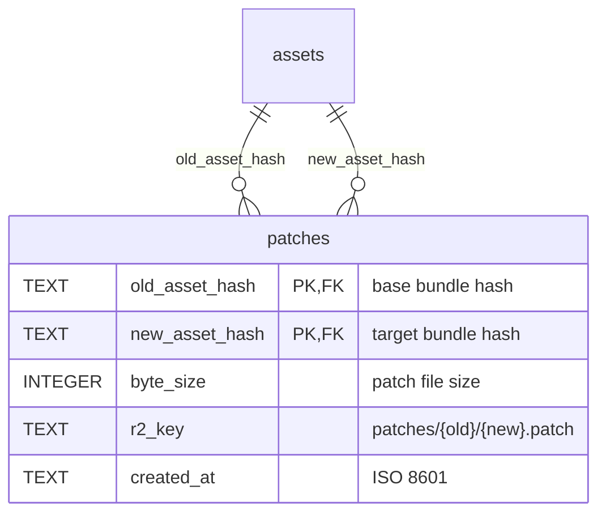
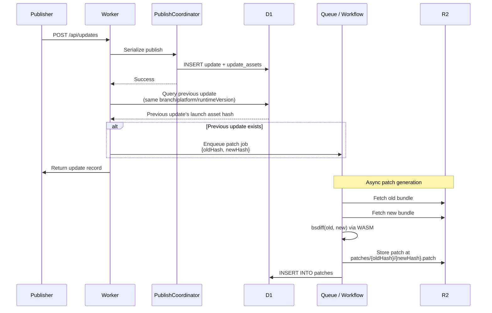
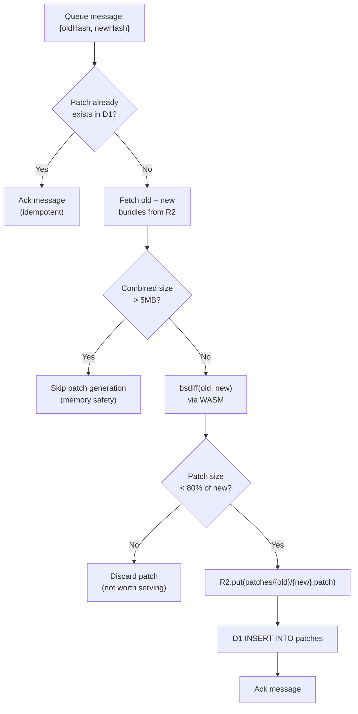
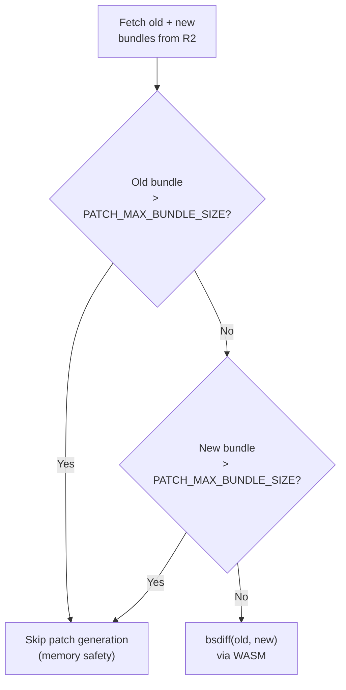
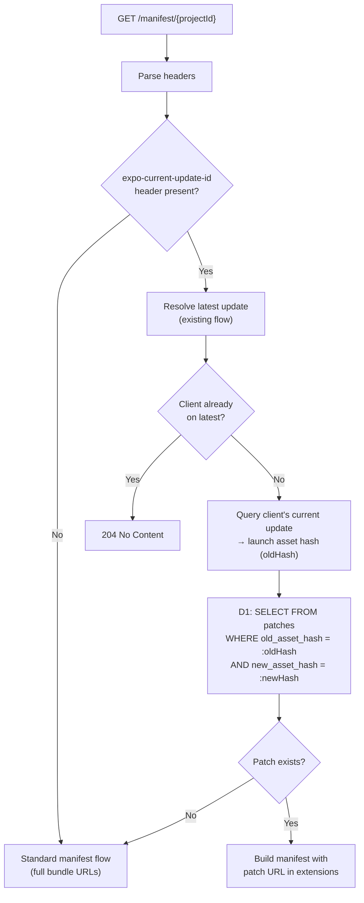
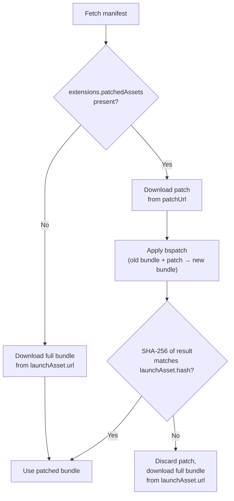

# 19. Bundle Diffing (Delta Updates)

## Overview

Reduce download size for OTA updates by serving binary diff patches (bsdiff) instead of full JS bundles. When a client already has a previous update, the server serves a patch that transforms the old bundle into the new one. Typical JS bundle diffs are 10-30% the size of the full bundle.

## Options Comparison

| Criteria                  | Option A: Pre-compute at Publish | Option B: On-demand in Worker       | Option C: Hybrid                    |
| ------------------------- | -------------------------------- | ----------------------------------- | ----------------------------------- |
| **Coverage**              | Previous update only             | Any base update                     | Any base update                     |
| **First-request latency** | No impact (async)                | Blocks response (500ms+ for bsdiff) | No impact (fallback to full bundle) |
| **Memory risk**           | None on request path             | High (128MB limit, 17n bytes)       | None on request path                |
| **Complexity**            | Low                              | Medium                              | High                                |
| **Worker CPU on request** | Zero                             | High (bsdiff in hot path)           | Zero                                |
| **Storage efficiency**    | 1 patch per update               | Unbounded (patch per unique base)   | Bounded (pre-compute + on-demand)   |
| **Failure mode**          | Graceful (full bundle fallback)  | Blocks response on OOM/timeout      | Graceful (full bundle fallback)     |

**Decision: Option A.** Simple, predictable, no risk on the request path. Covers the most common case (sequential updates on a channel).

## Data Model

### New Table: `patches`



| Column           | Type    | Constraints                         | Description               |
| ---------------- | ------- | ----------------------------------- | ------------------------- |
| `old_asset_hash` | TEXT    | PK, FK -> assets.hash               | Hash of the base bundle   |
| `new_asset_hash` | TEXT    | PK, FK -> assets.hash               | Hash of the target bundle |
| `byte_size`      | INTEGER | NOT NULL                            | Patch file size in bytes  |
| `r2_key`         | TEXT    | NOT NULL                            | R2 object key             |
| `created_at`     | TEXT    | NOT NULL, DEFAULT CURRENT_TIMESTAMP | ISO 8601                  |

**Primary key:** `(old_asset_hash, new_asset_hash)` -- one patch per unique pair.

### New Index

| Index                    | Columns          | Purpose                                  |
| ------------------------ | ---------------- | ---------------------------------------- |
| `idx_patches_new_asset`  | `new_asset_hash` | Find all patches targeting a given asset |
| `idx_patches_created_at` | `created_at`     | Garbage collection queries               |

## R2 Storage Layout

Patches stored alongside assets in the same R2 bucket, under a `patches/` prefix:

```
better-update-assets/
  assets/{hash}                          # full assets (existing)
  patches/{oldHash}/{newHash}.patch      # binary diff patches (new)
```

Patch objects use the same R2 metadata pattern as assets:

| R2 field          | Value                                 |
| ----------------- | ------------------------------------- |
| **Key**           | `patches/{oldHash}/{newHash}.patch`   |
| **Content-Type**  | `application/octet-stream`            |
| **Cache-Control** | `public, max-age=31536000, immutable` |

Patches are content-addressed (keyed by both input and output hash) and immutable -- same CDN caching strategy as assets.

## Publish-Time Integration

### Patch Generation Pipeline

After a new update is created, the publish flow enqueues a patch generation job:



### Previous Update Resolution

Query the previous update's launch asset on the same branch, platform, and runtime version:

```sql
SELECT a.hash
FROM updates u
JOIN update_assets ua ON ua.update_id = u.id AND ua.is_launch = 1
JOIN assets a ON a.hash = ua.asset_hash
WHERE u.branch_id = :branch_id
  AND u.platform = :platform
  AND u.runtime_version = :runtime_version
  AND u.id < :current_update_id
  AND u.is_rollback = 0
ORDER BY u.created_at DESC, u.id DESC
LIMIT 1
```

Uses `idx_updates_resolution` -- no new index needed.

### Patch Job Processing

Two implementation options for async processing:

**Option 1: Cloudflare Queue (simpler)**

Queue consumer Worker with dedicated WASM binding for bsdiff:



**Option 2: Cloudflare Workflow (more robust)**

Workflow with automatic retry per step and durable execution state:

```
Step 1: Check if patch exists (idempotency guard)
Step 2: Fetch old bundle from R2
Step 3: Fetch new bundle from R2
Step 4: Run bsdiff WASM (CPU-intensive step, up to 5 min limit)
Step 5: Upload patch to R2
Step 6: Insert metadata into D1
```

Workflow step results are capped at 1 MiB -- bundle data must be passed between steps via R2, not step return values.

**Decision: Queue.** Simpler to implement, sufficient for the common case. Queue messages that fail after max retries are sent to a dead-letter queue for investigation.

### Memory Safety Guard

bsdiff requires `max(17n, 9n+m)` bytes where n = old file size, m = new file size. Both inputs must be considered:

| Old bundle | New bundle | Memory required | Within 128MB limit? |
| ---------- | ---------- | --------------- | ------------------- |
| 1 MB       | 1 MB       | ~17 MB          | Yes                 |
| 3 MB       | 3 MB       | ~51 MB          | Yes                 |
| 5 MB       | 3 MB       | ~85 MB          | Risky               |
| 5 MB       | 5 MB       | ~85 MB          | Risky               |
| 7 MB       | 7 MB       | ~119 MB         | No                  |

**Hard limit: skip patch generation when `max(old, new)` exceeds 4 MB.** This provides ~60 MB headroom for WASM runtime, V8 overhead, and the output patch buffer. Configurable via `PATCH_MAX_BUNDLE_SIZE` environment variable (default: `4194304`).

The Queue consumer checks **both** input sizes before proceeding:



### bsdiff WASM Module

No existing npm package works in Workers (all are native Node addons). Compile from Rust:

- Source: [bsdiff-rs](https://github.com/space-wizards/bsdiff-rs) -- pure safe Rust, no C dependencies
- Target: `wasm32-unknown-unknown` via `wasm-pack`
- Binding: import as a WASM module in the Worker/Queue consumer

The WASM module exposes two functions:

```
bsdiff(old: Uint8Array, new: Uint8Array) -> Uint8Array  // generate patch
bspatch(old: Uint8Array, patch: Uint8Array) -> Uint8Array  // apply patch (client-side only)
```

## Request-Time Integration

### Manifest Response with Patch Resolution

On manifest request, resolve whether a patch is available for the client's current bundle:



### Patch URL in Manifest Extensions

When a patch is available, include it in the extensions part of the multipart response. The manifest itself remains unchanged (full bundle URL in `launchAsset.url`) for backward compatibility:

**Extensions part:**

```json
{
  "assetRequestHeaders": {},
  "patchedAssets": {
    "launchAsset": {
      "patchUrl": "https://cdn.updates.example.com/patches/{oldHash}/{newHash}.patch",
      "patchSize": 45231,
      "baseHash": "{oldHash}"
    }
  }
}
```

This design preserves backward compatibility:

- Clients without patch support ignore `patchedAssets` and download the full bundle via `launchAsset.url`
- Clients with patch support check `patchedAssets` first, fall back to `launchAsset.url` on failure
- The manifest part is unchanged -- no impact on code signing

### Cache Key Consideration

Patch resolution depends on `expo-current-update-id`, which varies per client. Two strategies:

**Strategy A (recommended): Do not cache patch-aware responses.**

Requests with `expo-current-update-id` bypass the Cache API entirely. The extra D1 query (`SELECT FROM patches`) adds ~2ms. This is acceptable because:

- Patch resolution is a single indexed query on the primary key
- Manifest construction is already fast (~5ms total for cache miss)
- Caching per (update-id, new-update) pair would fragment the cache with low hit rate

**Impact on overall caching strategy:** This cache bypass is documented in [spec 10](./10-caching.md#bundle-diffing-cache-bypass). It does not affect caching of standard manifest responses (without `expo-current-update-id`). The proportion of requests with this header depends on client adoption of delta updates — initially low, growing over time as clients update. Even at full adoption, the D1 query overhead (~2ms) is minimal compared to the bandwidth savings from smaller downloads.

**Strategy B: Two-pass resolution.**

First, resolve the manifest via the existing cached path. Then, in a second pass, check for a patch. Return the cached manifest with an additional extensions entry. More complex, marginal benefit.

### Updated Manifest Resolution Query

The existing resolution flow (spec 04) adds one D1 query when `expo-current-update-id` is present:

```sql
-- Step 1: existing resolution (unchanged)
-- Resolves latest update for branch/platform/runtimeVersion

-- Step 2: new -- resolve client's current launch asset hash
SELECT ua.asset_hash
FROM update_assets ua
WHERE ua.update_id = :currentUpdateId
  AND ua.is_launch = 1

-- Step 3: new -- check for patch
SELECT r2_key, byte_size
FROM patches
WHERE old_asset_hash = :oldHash
  AND new_asset_hash = :newHash
```

Steps 2 and 3 can be batched into a single D1 call.

## Client Protocol

### Client Requirements

1. `enableBsdiffPatchSupport: true` in `app.json` / `app.config.js`
2. Client sends `expo-current-update-id` header on manifest requests (ID of currently running update)
3. Client must be capable of applying bspatch to reconstruct the full bundle

### Client Flow



The SHA-256 verification is critical -- it ensures the reconstructed bundle is byte-identical to the full bundle, regardless of patch correctness.

## Garbage Collection

### Patch Expiry

Patches for old updates accumulate over time. Clean up based on age:

```sql
-- Find expired patches
SELECT r2_key FROM patches
WHERE created_at < datetime('now', '-30 days')
```

Processing:

1. Query expired patches from D1 (batched, 100 at a time)
2. Delete R2 objects (`R2.delete(r2_key)`)
3. Delete D1 rows (`DELETE FROM patches WHERE old_asset_hash = :old AND new_asset_hash = :new`)

**Trigger:** Cloudflare Cron Trigger, daily. Configurable retention via `PATCH_RETENTION_DAYS` (default: `30`).

### Cascade on Update Deletion

When an update is deleted (e.g., via management API), clean up associated patches:

```sql
-- Find patches where the deleted update's launch asset is either the old or new hash
DELETE FROM patches
WHERE old_asset_hash = :deletedLaunchHash
   OR new_asset_hash = :deletedLaunchHash
```

Delete corresponding R2 objects before removing D1 rows.

## Configuration

| Variable                | Default     | Description                                        |
| ----------------------- | ----------- | -------------------------------------------------- |
| `PATCH_MAX_BUNDLE_SIZE` | `4194304`   | Max bundle size in bytes (per input, not combined) |
| `PATCH_MIN_SAVING`      | `0.8`       | Patch must be < this ratio of full bundle to keep  |
| `PATCH_RETENTION_DAYS`  | `30`        | Days before expired patches are garbage collected  |
| `PATCH_QUEUE_NAME`      | `patch-gen` | Cloudflare Queue name for patch jobs               |
